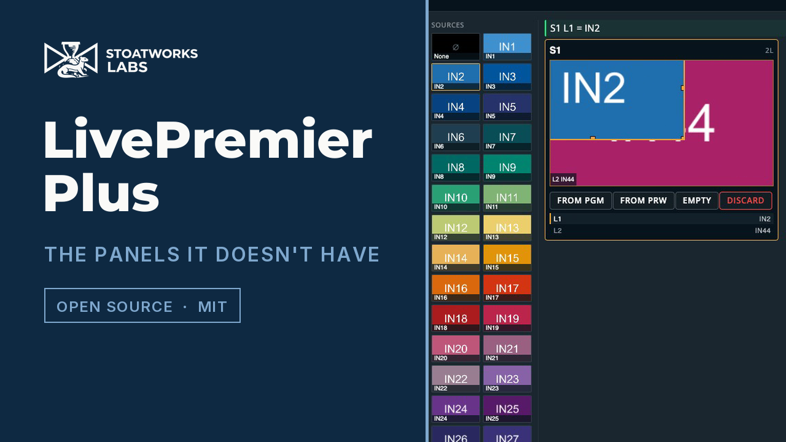

> **AI-assisted project.** This codebase was created with [Claude Code](https://claude.com/claude-code).
> The panels render inside a real Web RCS session and the device store mirrors live, both verified
> through this proxy against **LivePremier Simulator 6.2.73**. **In field testing:** every path this
> app emits has been checked against a physical **Aquilon C** and, since 0.6.0, a physical
> **Pulse 4K**, where the Midra port's writes were proven over AWJ and **the Console panel made this
> app's first writes to a real device**, typed by the operator. The timeline has still only ever
> fired at a simulator. The Status note below is specific about which is which.

# LivePremier Plus

A local app that adds panels to an Analog Way **LivePremier** Web RCS session,
drawn in Web RCS's own design language so they read as part of the product
rather than as a bolt-on:

- **Edit** — the Screens / Aux. page with one row instead of two: a programmer
  buffer that is on neither bus. Build a look with the same sources, the same 67
  layer parameters and the same memory bank, and nothing reaches the switcher
  until you save it — at which point it goes straight into a real memory slot,
  with no preset buffer written and no take fired.
- **VPU Map** — the device's mixing-resource allocation, drawn as a budget.
  Which units are fitted, who holds them, what is spare, and what a staged
  preconfig would change.
- **Console** — Mynah's command line, a lighting-desk grammar for a video
  switcher. `Recall Screen 1 Memory 5`, `R Sc 1 Th 4 Me 5 Pre`, `Take Screen 1`.
  It also takes raw AWJ, raw Web RCS store writes and OSC addresses, says what a
  line will do before Enter, and pops out into a window of its own. On a Midra
  4K or Alta 4K it routes audio as well: `Set Audio Patch Input 3 To Screen 1`.
- **Timeline** — a theatre-style cue stack. A numbered list that advances on
  one GO, with per-cue fade, delay and follow times, driving the switcher's
  preset recalls and TAKE. A cue can also carry a **timecode** and fire when
  MIDI Time Code, LTC from an audio input, or a timecode pushed from another
  machine passes it.
- **Memories** — all three banks in one list: master, screen and layer, with
  search, renaming, and which buffer is holding each memory right now. Recall
  names its target buffer every time and never defaults to program. Pops out
  onto a second monitor.
- **Layer** — every one of a layer's 67 properties, generated from the device's
  own parameter catalogue rather than transcribed, so a firmware that adds one
  grows a field for it. **Name a layer** here and the name appears in the
  vendor's own layer lists — the switcher itself has nowhere to keep one.
- **Layer Groups** — several layers, on one screen or on many, driven as one.
  Layer 2 on screen 1 with layer 1 on screens 2 and 3 is *the side screens*, and
  a ganged group follows a source change made to any of its members, wherever
  that change came from.
- **Send to** — a `…` on every source card that routes it without a drag:
  preview or program, then a screen and layer or a whole group. It respects the
  vendor's own PGM padlock, asking before it steps past one.
- **Matrix Routing** — patch the frame's own SDI and HDMI sockets to ports on a
  Blackmagic Videohub, a Lightware or a Turtle AV router, and route through it
  from the panel, a cue, the Console or OSC. You describe the cable; the
  direction inverts on its own.
- **Companion** — a Bitfocus Companion linked to this app: its pages of buttons
  drawn in the app's own look, live and pressable, and poppable onto a second
  monitor; a **Companion trigger** on any cue and on any memory recall, so the
  show presses the buttons as it runs; and Companion's own editor served on the
  same address as Web RCS, with no second port and no CORS. A panel lists the
  show's real connections, follows them live, and offers to add the AWJ and
  LivePremier Plus connections pointed at whichever switcher you are on —
  saying what it will create before it does.
- **Pitch Compensation** — a screen spanning LED walls of different pixel
  pitches needs H and V ratios per output, and the device has the fields and no
  help filling them in. Give it the pitches; it reads everything else off the
  switcher and writes the ratios on a second press.
- **OSC input** — QLab, TouchOSC, a lighting desk or Companion drive the switcher
  over UDP, with no browser open. Off until you turn it on; every address is in
  [docs/OSC.md](docs/OSC.md).
- **MIDI Mapping** — a control surface driving the switcher, from the page
  itself. Faders to opacity, encoders to size and position, buttons to select.
- **Pixelhue panel** *(preview)* — a Pixelhue U5, U5 Pro or U5 mini drives the
  switcher from a model of it rather than from a key map. It has never yet been
  run against a real console.
- **Thumbnail relay** *(preview, off by default)* — the switcher's source
  thumbnails re-encoded as JPEG and shared between pages: a twentieth or less of
  the bytes the vendor's pages would otherwise pull, and every Web RCS tab gets
  it without a change to the vendor's code. It has never yet run against a real
  frame.
- **Your setup in one file** — the cue stack, layer groups, layer names, router
  patch and settings, written as one plain JSON file and read back the same way,
  so a rig restores with its `.awc` rather than half of it.
- **Arithmetic in the vendor's own numeric fields** — type `1080-80` into a
  layer width and get 1000, the way you can in every other tool on the desk.

**Every one of these is a plugin you can switch off**, in Preconfig ▸
LivePremier Plus → Plugins; a switched-off feature leaves no menu entry, route or
background service behind. **You can add your own**: a folder in
`~/.livepremier-plus/plugins/` (or `/config/plugins/` in Docker) with a
`plugin.json`, a server half and a page half. They start switched off, and run
only once you switch them on. [docs/PLUGINS.md](docs/PLUGINS.md) is the guide, and
[`examples/plugins/hello-switcher`](examples/plugins/hello-switcher) the template.

Point it at a switcher, open the address it prints, and you get the vendor's
own Web RCS with the extra panels already in it. The panels ride the vendor
app's own WebSocket — no second Web RCS connection to the device, no replacement
UI, and nothing to install in the browser. (OSC input, the Pixelhue panel and
the Edit page's direct save each open a brief AWJ connection of their own when
they act, and AWJ has a budget of five clients on the switcher.)

It runs as a desktop tray app for macOS, Windows and Linux, as a Docker image,
or from the command line with Node 20. It works on a **LivePremier** and — for
the Timeline, Console, Memories, Layer and Pitch Compensation — on a **Midra 4K
or Alta 4K** as well; [Platforms](#platforms) says which panels each gets.

> **Status: field testing — v0.13.0.** The panels render inside a real Web RCS
> session and the device store mirrors live — both verified through this proxy
> against LivePremier Simulator 6.2.73, along with cue-stack persistence and
> the whole setup flow. The VPU map has been **read from a live Aquilon C** and
> is tested against that capture, including Optimized mode, interleaved output
> links, and a staged preconfig that differs from the running one.
>
> **The Edit page was driven on a simulator on 2026-09-22**, and the thing it
> claims was measured rather than asserted: all three of S1's preset buffers
> were read over AWJ before and after a full editing session — seed from
> program, a source dropped on a layer, a layer dragged and resized — and came
> back **byte-identical**. A look was then saved into memory 900 by the direct
> route and the device reported the slot valid with the operator's label, with
> those three buffers still identical; the memory was read back into an emptied
> programmer, 132 properties, the dragged position exactly where it had been
> left; and a second look went into 901 by the preview route, with preview
> restored property-for-property afterwards. Both test slots were deleted.
>
> ⚠️ **The direct route has an open question on real hardware.** The path the
> device extracts the memory file from is the *switcher's* filesystem. On a
> simulator that is the same machine, which is why it works here; on an Aquilon
> it is the box's own disk, and Web RCS 6.2.73 exposes no memory import and no
> upload route for one. That is exactly why the preview route exists as well —
> it is also the only route on Midra 4K and Alta 4K, whose banks have no import
> at all — and why the directory is a setting rather than a constant.
>
> **Companion was driven against a running Companion 5.0.5 and a LivePremier
> simulator on 2026-09-22**: the mounted Buttons page loaded same-origin with its
> grid drawn and one socket relayed; the panel listed the show's three real
> connections with live status, and its feed followed a connection being
> disabled and re-enabled; and an AWJ connection was added, configured and
> reported `good`.
> The cross-origin WebSocket check was confirmed live — `101` for the page we
> served and for a client sending no Origin, `403` for a forged origin and for
> the `null` a sandboxed iframe sends. **The LivePremier Plus connection cannot
> be added yet**, because there is no LivePremier Plus Companion module yet: the
> panel says so in those words. Merged into 0.11.0 after the Edit page; the
> merged proxy, settings and panels were re-checked through the proxy, but not
> against a live Companion a second time.
>
> **Layer groups and the send-to menu were driven on a simulator on
> 2026-09-21**, against a preconfig staged for the purpose: two screens on
> **opposite preset letters** — S1 at `AT_UP` with program B, S2 at `AT_DOWN`
> with program A — which is the only arrangement in which getting the role
> conversion wrong shows up. A change to S1's layer 2 in letter B was followed
> onto S2's layer 1 in letter **A**, leaving S2's preview untouched; a group
> send in preview wrote both members' preview buffers and neither program; and
> a program send was held behind the confirmation step while the vendor's PGM
> padlock was shut and went straight through once it was opened, both read
> from the vendor's own buttons. No physical LivePremier has seen any of it.
>
> **Verified against real hardware (Aquilon C `NLC_C`, firmware 6.2.73,
> 2026-09-09).** Every path this app emits was checked against the box: the
> command table resolved with no `E12`, the VPU collections answered, and the
> pitch paths resolved — confirming `pitchedWidth`/`pitchedHeight` really do
> live under `canvas/status`, and that the output collection key is numeric
> (`1`), not `OUTPUT_1`, which the device refuses. The device store was pulled
> whole (124 MB) and the VPU model re-checked against it rather than against a
> capture. Nothing disagreed with what the simulator had taught us.
>
> **The VPU map's header is part-verified from that same pull (2026-09-15).**
> The header over the grid's columns names each link's region and output plug
> from `outputList` — `usedInScreenAux`, `usedInRegion`, `capability`, the
> mapping and the plug type — and every one of those fields is in the store
> the box gave us, with each screen's outputs adding up to its own figures
> (`test/fixtures/aquilon-c-dual-outputs.json`). **Not yet verified on a box:
> the order in which a screen's links run over several outputs** — every screen
> on that pull had one — so a screen whose outputs do not add up gets no header,
> and the next time an Aquilon is reachable, aquilon-vpu-map's
> `scripts/probe-hardware.mjs` step 6 and its capture guide say what to check.
>
> **Driven in a browser against the box (2026-09-10).** The sidebar entries and
> the two Preconfig flyout pages have now been opened and navigated against a
> live Aquilon C in an ordinary browser session, rather than only against the
> simulator. That is what turned up the blank page fixed in 0.4.1: closing a
> panel handed back a `display: none` the panel had written itself, and Web RCS
> carried on routing and rendering into an element no wider than nothing.
>
> **The Memories and Layer panels (new in 0.5.0) were driven against the same
> box** the day they were written: 85 screen memories listed under their real
> names, and program/preview resolved and checked against the device's own
> `presetUp`/`presetDown`/`transition`. Their writes — recall, save, erase,
> rename, and a layer property with its clamp — were exercised with the socket
> **stubbed**, so the paths and values are proven and the switcher received none
> of them.
>
> **Midra 4K and Alta 4K (2026-09-12).** The Timeline, Console and Layer
> tabs, the Memories panel and Pitch Compensation now work on the other
> Analog Way platform too — every model of it. The
> object model was read off a **live Pulse 4K** (firmware 3.3.10, read-only,
> mid-show) and the port was then driven against the **Midra 4K simulator as a
> Pulse 4K and the Alta 4K simulator as a Zenith 200**: cues fired through the
> panel's own GO (recall → fade → take, with the device echoing each step
> back), memories saved, renamed and recalled through the Memories panel,
> including the aux bank. QuickVu, Eikos, QuickMatrix and Zenith 100 stores
> were captured and checked too; all six share one object model. See
> [Platforms](#platforms) for what is and is not offered there.
>
> **Proven on the live Pulse 4K (2026-09-12/13).** With the show's screens
> frozen, a test harness ran the port's whole write vocabulary against the box
> — `takeTime`, store, label, recall into the buffer the `UP`/`DOWN` rule
> names, a recall of an empty slot (silence, as documented), two TAKEs with
> preview holding program, restore and delete, a layer opacity on preview, a
> multiviewer layout, a pitch ratio — **39 checks, none failed**, the baseline
> re-read identical apart from the device's own bookkeeping. The next morning
> the operator typed the Console's lines at the real box: the four offline
> refusals, then a backup, a recall to preview, a `takeTime` over the OSC
> spelling, and the restore — **the first writes this app's own panels have
> made to a physical device**, all as expected. (The `Set … Opacity` typed in
> the same run was refused by that build's Console, which handed the compiler
> no device facts — the bug 0.7.0 fixes; the opacity write itself is the
> harness's W7.) Two things only hardware
> could show: with *preset toggle* off a take passes `COPY_FROM_x` after its
> effect, so the settle is takeTime plus ~250 ms, and `isLoading` is a real
> 30 ms window rather than the simulator's zero. `docs/NOTES.md` has the rest.
>
> **0.13.0 (2026-09-23).** **Every feature is a plugin.** Each panel, page and
> background service — the Console, the Timeline, Matrix Routing, Companion and
> the rest, eighteen in all — is its own plugin, and each can be switched off in
> **Preconfig ▸ LivePremier Plus → Plugins**: off means gone, with no menu entry,
> route or background connection left behind. **Plugins of your own** go in the
> data directory's `plugins/` folder and stay off until you switch them on —
> [docs/PLUGINS.md](docs/PLUGINS.md) is the guide, with an example to copy. Fixed
> on the way: a panel no longer loses the caret, the selection or half-typed text
> to the once-a-second repaint, and an open dropdown no longer closes under the
> pointer; the Companion link no longer drops every 35 s, and its embedded editor
> no longer reloads every second; pointing the app at another switcher no longer
> stops OSC input, the routers, Companion or the Pixelhue panel until a restart;
> and restoring a setup file now reaches the running app, not just its files.
> ⚠️ The Companion, Pixelhue, OSC input and Edit-page settings now live inside
> their plugins. An upgrade moves them for you; going back to 0.12.0 loses them.
>
> **0.12.0 (2026-09-22).** **Router routing on the vendor's own pages.** A
> **Router** tab on Inputs ▸ an input and Outputs ▸ an output, and a **Router**
> box in Preconfig ▸ Inputs / Outputs. Each shows which router port the cable
> is on (patchable in place) and the router's ports as a grid of tiles and as a
> list: an input picks one source and routes on the click, an output picks any
> number of destinations and sends them on **Route**. Nothing lights until the
> router reports it. Proven against the simulator and a Videohub emulator — not
> yet against a real router.
>
> **0.11.0 (2026-09-22).** **Companion**, served inside this app. A Bitfocus
> Companion's admin pages, web buttons and emulator open on the same address as
> Web RCS — Companion's own sub-path support with this proxy in front, so there
> is no second port and no CORS — and a panel lists the show's real connections,
> follows them live, and offers to add the AWJ and LivePremier Plus connections
> pointed at the switcher you are on, saying what it will create before it does.
> Companion's cross-origin WebSocket check is re-made here rather than bypassed.
> The LivePremier Plus connection cannot be added until a Companion module for
> this app exists; the panel says so. Linking a Companion also puts its admin UI
> behind this proxy, which is why the binding-wide warning now names it.
>
> **0.10.0 (2026-09-22).** The **Edit page** — the Screens / Aux. layout with one
> row instead of two, and that row is a *programmer*: a buffer that is on neither
> preview nor program. The same sources, the same sixty-seven layer parameters and
> the same memory bank, with a stage you can drag and resize a layer on, and
> nothing reaching the switcher until you save a memory. Saving offers two routes
> and says what each costs: **direct**, which writes the bank itself through a
> facility Web RCS does not expose — no preset buffer, no take — and **via
> preview**, which borrows the preview buffer, fires the switcher's own save and
> puts preview back property-for-property. `docs/NOTES.md` has the device work
> behind it, including why the third preset buffer C looks like the answer and is
> not.
>
> **0.9.0 (2026-09-21).** Two things an operator keeps doing by hand.
> **Layer Groups** name a set of layers across screens and drive them as one — a
> ganged group follows a source change made to any member, whatever made it —
> and a **`…` on every source card** routes an input to a screen and layer, or
> to a whole group, in preview or program, without a drag. You write a *role*,
> never a preset letter, because which letter is program changes on every take.
> **Matrix Routing** patches the frame's own SDI and HDMI sockets to ports on a
> Blackmagic Videohub, a Lightware or a Turtle AV router: you describe the
> cable, the direction inverts on its own, and the crosspoints are reachable
> from the panel, a cue, the Console and OSC. The Videohub driver was driven end
> to end against a working implementation of that protocol; the Lightware and
> Turtle AV drivers are written from their vendors' documents and have not met
> the hardware — `docs/MATRIX.md` says how to prove each on your own kit.
>
> **0.8.1 (2026-09-18).** The desktop launcher says why a start failed. Pressing
> Start with the port held — another copy of the app, or the proxy started
> by hand — used to look like nothing happening; it now says so on the click
> and keeps Open available, names a port the OS refuses or an interface
> address that has gone, and quotes a proxy that dies right after starting
> with its last output lines. The shell is av-launcher 21bc307; nothing in
> the proxy or the panels changed.
>
> **0.8.0 (2026-09-17).** The VPU map reads the grid top to bottom the way an
> output link runs: the native band sits above the eight layer links, a screen
> whose next layer landed on another VPU keeps its columns there — the two
> cards stack and the link draws straight down out of one and into the next —
> and a header over the columns names each link's region and output plug from
> `outputList`, with the real Aquilon C outputs of 2026-09-09 as a fixture.
> The desktop launcher now stops the proxy it supervises on every exit path
> (⌘Q and Quit from the Dock left the Node process holding the port); the
> shell is av-launcher 2c83ad7.
>
> **0.7.0 (2026-09-13).** Three things, all proven on the simulators and not
> yet on hardware. **Audio routing on Midra 4K / Alta 4K**, at the Console:
> `Set Audio Patch Input 3 To Screen 1` writes the preset's audio layer,
> `Follow Layer 2 On Screen 1` or `Follow Screen 2 On Line Output 1` what a
> point follows, `Mute Output 1 Channel 3 Thru 4` where the device keeps it —
> mynah 1.5.0, vendored; the vendor's own header dropdown changed to "Input 3"
> when the line was typed at the Pulse simulator. **A loopback door for a
> LAN-bound server**: bind to an interface and it still answers on
> `127.0.0.1`, a browser on the same machine arriving by the LAN address is
> sent there, and the secure-context note names the page that is actually
> open. **And the Console now hands mynah the device facts it asks for** —
> every `Set` typed at it since the Console existed had been refused with
> "needs a live connection" beside a live connection; the panel is now tested
> by typing at it, over both platforms' store captures.
>
> **Still untested on hardware, and this is the honest part:** on LivePremier
> the panels have written only to the simulator and, with the socket stubbed,
> proven their paths against an Aquilon; on Midra the Timeline's GO, the Layer
> tab's edits and the Memories panel's own buttons have written to the
> simulators only. The Console is the one panel to have written to a real box.

[](https://www.youtube.com/watch?v=gYI1xJLEYXE)

**[Watch the tour (77s)](https://www.youtube.com/watch?v=gYI1xJLEYXE)** — the real
application, filmed on Analog Way's LivePremier simulator: the Edit page building
a look off air and saving it into a real memory slot, Companion served inside the
app, layer groups and the `…` on a source card, routing through a Videohub
emulator, the VPU map, the Console and the Timeline. It was filmed on 0.12.0;
0.13.0 changed how the app is built, not what it shows. The first video, with
the VPU map off a real Aquilon C capture and `1080-80` becoming 1000 in a layer
width, [is still up](https://www.youtube.com/watch?v=mGjGiNO_tSo).

---

## Running it

Needs **Node 20 or newer** and has no dependencies to install.

```bash
npm start
```

Then open `http://127.0.0.1:8535/` and give it the switcher's address. That
address is remembered, so subsequent runs go straight to the Web RCS.

You can also name the device up front, which skips the setup page:

```bash
npm start -- --device 192.168.2.142
```

| flag | meaning |
| --- | --- |
| `--device <host[:port]>` | the switcher. Port defaults to 80 (a simulator is usually `:3000`). |
| `--port <n>` | local port to listen on (default 8535) |
| `--host <addr>` | local address to bind (default `127.0.0.1`). Bind a LAN address or `0.0.0.0` to reach it from other machines; this machine should still open it at `127.0.0.1` — see [secure contexts](#why-this-needs-no-offscreen-document) — and a local browser that arrives by the LAN address is sent there. |
| `--data <dir>` | where cue stacks are kept (default `~/.livepremier-plus`) |

There is a desktop app too — a tray launcher with an interface and port picker,
in the fleet's usual shape. See [launcher/](launcher/).

### In Docker

An image is published to `ghcr.io/stoatworks-labs/livepremier-plus` on every
push to `main`, as `:latest` and as the commit's SHA. There is no per-version
tag, so **`:latest` can be ahead of the last release** — to pin one, use the
SHA its tag points at. The repo's `docker-compose.yml` runs it with the cue
stacks and the remembered switcher kept in `./config`:

```bash
docker compose up -d
```

or on its own:

```bash
docker run -d -p 127.0.0.1:8535:8535 -v "$PWD/config:/config" \
  ghcr.io/stoatworks-labs/livepremier-plus:latest
```

Inside the container it has to listen on `0.0.0.0` to be reachable at all, so
where it is reachable *from* is decided by the port you publish.
**`docker-compose.yml` publishes `8535:8535` — every interface on the host** —
which is the binding-wide case below; change it to `127.0.0.1:8535:8535` unless
the whole network is meant to reach it. Set `LPP_DEVICE` to skip the setup page.

<!-- Nothing between the markers is hand-written: gen-downloads.py owns it,
     heading and all, and rewrites it wholesale at each release. -->
<!-- downloads:start -->

## Download

**[v0.13.0](https://github.com/stoatworks-labs/livepremier-plus/releases/tag/v0.13.0)** — prebuilt for macOS, Windows and Linux. Pick your platform:

<details>
<summary><b>macOS</b> — Universal (Apple Silicon + Intel)</summary>

| Build | Download | Size |
| --- | --- | --- |
| Universal (Apple Silicon + Intel) · .dmg disk image | [`livepremier-plus-0.13.0-macos-universal.dmg`](https://github.com/stoatworks-labs/livepremier-plus/releases/download/v0.13.0/livepremier-plus-0.13.0-macos-universal.dmg) | 82 MB |
| Universal (Apple Silicon + Intel) · .pkg installer | [`livepremier-plus-0.13.0-macos-universal.pkg`](https://github.com/stoatworks-labs/livepremier-plus/releases/download/v0.13.0/livepremier-plus-0.13.0-macos-universal.pkg) | 82 MB |

</details>

<details>
<summary><b>Windows</b> — x64</summary>

| Build | Download | Size |
| --- | --- | --- |
| x64 · .exe installer | [`LivePremier.Plus_0.13.0_x64-setup.exe`](https://github.com/stoatworks-labs/livepremier-plus/releases/download/v0.13.0/LivePremier.Plus_0.13.0_x64-setup.exe) | 25 MB |

</details>

<details>
<summary><b>Linux</b> — x64</summary>

| Build | Download | Size |
| --- | --- | --- |
| x64 · .deb package (Debian/Ubuntu) | [`LivePremier.Plus_0.13.0_amd64.deb`](https://github.com/stoatworks-labs/livepremier-plus/releases/download/v0.13.0/LivePremier.Plus_0.13.0_amd64.deb) | 50 MB |
| x64 · .rpm package (Fedora/RHEL) | [`LivePremier.Plus-0.13.0-1.x86_64.rpm`](https://github.com/stoatworks-labs/livepremier-plus/releases/download/v0.13.0/LivePremier.Plus-0.13.0-1.x86_64.rpm) | 50 MB |

</details>

All builds, checksums and release notes: [github.com/stoatworks-labs/livepremier-plus/releases](https://github.com/stoatworks-labs/livepremier-plus/releases).

macOS builds are signed and notarised and open normally. The Windows builds are unsigned, so SmartScreen warns once.

<!-- downloads:end -->

> **On binding wide.** The default is loopback for a reason: this proxy is an
> unauthenticated route to a switcher's entire control surface — and, once a
> Companion is linked, to that Companion's admin UI too. `--host 0.0.0.0` hands
> both to everyone on the network. Do it deliberately, not by habit.

## Console

Mynah's command language, inside Web RCS. Verb first, then objects, innermost
scope last; every keyword abbreviates to any unambiguous prefix; Enter executes
and nothing is sent before it.

```
Recall Screen 1 Memory 5
R Sc 1 Th 4 Me 5 Pre          the same command
Store Master 12
Take Screen 1
```

The line parses as you type and shows what it will do — `Recall 3 → Screen 1
Preview` — before anything reaches the device. Tab completes, ↑ recalls
history.

**This panel owns no grammar.** Every token, rule and device path comes from
`src/vendor/mynah-lang.mjs`, which is [mynah](https://github.com/stoatworks-labs/mynah)'s
own `npm run build:lang` output — the same artefact its Companion module
vendors. If a command means the wrong thing, the fix is in mynah.

That is worth more than tidiness. Mynah's compiler and this repo's `CMD`
builder were arrived at independently — and they emit **byte-identical** store
paths for the commands both know. Two independent derivations agreeing is the strongest evidence either is
right, and it stays true only while nobody re-types the grammar here. A test
pins it.

### Four languages, one line

The same command line also takes raw AWJ, raw Web RCS store JSON, and OSC.
These are all the same write:

```
Take Screen 1
AWJ DeviceObject/$screenAuxGroup/@items/S1/control/@props/xTake = true
{"path":["device","screenAuxGroupList","items","S1","control","pp","xTake"],"value":true}
/lp/screen/1/take
```

Mynah is the language for driving a show. The other three are for the times a
show is not going well: a path out of a packet capture, a frame out of a
browser's network panel, an address a lighting desk is already sending. Each is
something you already have in front of you, and translating it by hand costs a
typo on a live frame.

Each line is read as whichever language it looks like, and the verdict is shown
beside the feedback before you press Enter — a line read as the wrong language
complains about a character rather than about a command, which reads like your
own typo. A leading `MYNAH`, `AWJ`, `JSON` or `OSC` says which outright, and
**Settings → Console language** can turn detection off altogether.

### Reading a value back

`AWJ get DeviceObject/system/$device/@items/1/@props/dev` answers. Nothing else
here does — the vendor's socket carries a stream of changes rather than a
request and its answer — so a `get` goes out on a **real TCP 10606 socket**
opened by this process, and the reply lands in the console log.

Everything else rides the vendor's own connection, whichever language it was
typed in: one path is held once and rendered for either transport, so an AWJ
message converts to a store write and lands at the same node. **Settings → AWJ
via** switches that, for when you want the message on the wire exactly as
typed; the device allows five AWJ clients and this spends one of them for the
length of each exchange.

## OSC input

Off by default. Turn it on in **Preconfig ▸ LivePremier Plus → OSC input** and this process listens
on a UDP port, so QLab, TouchOSC, Companion or a lighting desk can drive the
switcher directly.

```
/lp/screen/1/take
/lp/screen/1/memory/5/recall/preview
/lp/master/memory/12/store
/lp/screen/1/preset/a/layer/2/opacity/opacity/norm 0.5
```

**[The full dictionary is in docs/OSC.md](docs/OSC.md)** — every address, its
argument and its range. It is the same address space the MIDI mapping binds to:
a fader is bound to a screen, a preset, a layer and a parameter, and that
four-part address is the same thing whether it arrives as a control change or
as a packet. The document is generated from the resolver's own tables, so it
cannot describe an address that does not work.

Four things worth knowing before you wire a surface to it:

- **The address is the target; the argument is only the value.** A button with
  a fixed address and no argument still means something specific, which is what
  lets a TouchOSC layout be drawn once with no logic behind it.
- **A trigger fires on a non-zero argument and on none at all.** Surfaces send
  `1` on press and `0` on release; firing on both would take the screen twice.
- **A recall never defaults to program.** `/lp/screen/1/memory/5/recall` goes to
  preview. Reaching air costs the explicit word, here as everywhere else.
- **`/norm` takes 0–1 and scales; without it the value is in the device's own
  units.** Opacity is 0–256, not 0–100. Which one `0.5` meant cannot be worked
  out from the value, so it is said in the address instead.

It binds to loopback unless you choose otherwise, and the other option says in
as many words that the network will be able to fire takes. Messages are written
to the switcher over AWJ, so it works with no browser open — which is the
point — and that port can be switched off in the Web RCS security settings.

> **Over UDP, live layer parameters must name a buffer** — `/a`, `/b` or `/c`.
> `preview` and `program` name whichever buffer is pending or live right now,
> and resolving that needs the device's take state, which this listener does
> not hold. It refuses those addresses with that reason rather than guessing.
> The Console *can* resolve them, because the page has the device store.

## Matrix routing

Patch the switcher's own SDI and HDMI connectors to ports on a **Blackmagic
Videohub**, a **Lightware** or a **Turtle AV** router, then route through it —
from the panel, from a cue, from the Console or over OSC.

Tell it about the **cable** and the rest follows:

```text
  switcher INPUT   <--- cable ---   router OUTPUT     (the router feeds us)
  switcher OUTPUT   --- cable --->  router INPUT      (we feed the router)
```

That inversion is the whole model. From it come the two operations, which are
deliberately not symmetrical: an input is fed by one router output, so choosing
its source is one crosspoint and fully determines what it sees; an output
arrives at one router input, which can be sent to any number of destinations at
once.

The panel names sockets in the device's own words — `Input 13 · card IN_2 ·
connector IN_25 · sdi` — because which connector "card 2, port 1" is depends on
a legend this app cannot see.

**Nothing is optimistic.** A driver never writes its own state: a click does
not move the grid until the router says it moved. A Videohub answers a refused
route with ACK and the *unchanged* routing, so a UI that showed what it asked
for would lie during exactly the minute that matters.

> ⚠️ **No real router has ever driven this.** The Videohub driver is a port of
> BlackMatrix's, exercised against a working implementation of the protocol;
> the Lightware and Turtle AV drivers are written from their vendors' protocol
> documents and have never spoken to hardware. The patch model and the
> connector reader *are* checked against a real LivePremier's own store.
> **[docs/MATRIX.md](docs/MATRIX.md)** has the whole thing, including a short
> procedure for proving each driver on your own kit.

## Pitch Compensation

Under Preconfig, beside the two fields it fills in.

A screen spanning LED walls of different pixel pitches needs each output group
told how much canvas its raster is worth, or a layer crossing the join changes
physical size the instant it crosses. The device has the fields for it —
Preconfig > Canvas > Pitch, **H Ratio** and **V Ratio** — and no help at all
working out what to put in them.

The device knows every number but one. It has the rasters, it knows which
outputs are on the screen, and it will say what ratios are set. It has no idea
how far apart the LEDs are, so the panel reads the first lot and asks you for
the pitches — one per output, `2.6`, or `2.6 x 3.0` if the pixels really are
not square.

**The engine is [aquilon-pitch](https://github.com/stoatworks-labs/aquilon-pitch)'s,
vendored** into `src/vendor/pitch-engine.js`. It carries four things that are
easy to get backwards and still look right, each established there by driving a
simulator rather than reading the manual:

- the ratio **multiplies** a group's raster to give its canvas footprint, so a
  **coarser** wall takes a ratio **above** 1.000
- the field is an integer in thousandths, range 0.100 to 10.000
- an out-of-range write is **discarded** by the device, not clamped — so a
  ratio that will not fit is refused here rather than sent
- the footprint **floors**, so 1080 × 1.234 is 1332 and not 1333

Applying takes two presses. It is a preconfig change, it moves every output on
the screen at once, and it is the only control in the panel that touches the
device — so it should be hard to hit by accident. When the device already holds
the computed ratios the button says so and does nothing.

## MIDI Mapping

Under Virtual RC400T. Pick an input, an output for feedback, and a controller
profile; Start. Faders, encoders and buttons then drive the selected layer.

**The engine is [awj-surface](https://github.com/stoatworks-labs/awj-surface)'s,
vendored whole** into `src/vendor/surface/` along with its stock profiles
(X-Touch/Mackie, APC40, MIDIcon 2 and Pro, plus a generic learn profile).
Decoding, soft pickup, encoder acceleration, MCU feedback and the parameter
catalogue are all upstream's. This repo contributes a front-end and nothing
else.

Soft pickup is the behaviour worth knowing: a non-motorised fader will not move
a live value until it has swept through that value, so picking up a fader
mid-show cannot jump a layer's opacity. The panel shows the hold-off rather
than looking broken.

### Why this needs no offscreen document

`navigator.requestMIDIAccess()` is a **secure-context** API. When this project
was a Chrome extension the page was a Web RCS on a plain-HTTP LAN address —
not a secure context — and a content script inherits the page's context, so
neither world could use it. The answer then was an offscreen document on the
`chrome-extension://` origin relaying MIDI through a service worker.

None of that is needed here. The proxy serves the vendor UI from
`http://127.0.0.1:<port>`, loopback **is** a potentially-trustworthy origin, so
the page is a secure context and Web MIDI is simply available. It also fixes
the SysEx problem: an invisible offscreen document cannot show a permission
prompt, so Mackie scribble strips needed granting from a separate page. A
normal page just asks.

The corollary: **a plain-http page on any address but loopback has no Web
MIDI and no audio input** — the switcher's own address, and equally this
app's own when the launcher binds it to a LAN interface and opens
`http://192.168.2.69:8534/`. Until 0.7.0 the note on the Settings page only
knew the first case and told an operator already inside LivePremier Plus to
open LivePremier Plus. Now: a LAN-bound server always answers on `127.0.0.1`
as well, a browser on the same machine that arrives by the LAN address is
redirected there (the server can tell — a connection whose source address is
the very address it connected to was made on this host, and nothing else
qualifies, not even a VM behind a NAT bridge), and the note names the page
that is actually open, the loopback door with its port, and the fact that
another machine would need HTTPS, which this app does not serve yet. Only
top-level navigations are redirected; the vendor app's fetches and its socket
stay where they are.

## Thumbnail relay — preview

The switcher's source thumbnails are PNGs its firmware writes with next to no
compression — about 148 KB each at 256×144 on an Aquilon C, 590 KB at 512×288
on a Pulse 4K — and the Web RCS asks for every input's about once a second.
Ten inputs on a Pulse is some 47 Mbit/s of thumbnails.

Switch the relay on in Preconfig ▸ LivePremier Plus → Plugins and this app
answers those requests itself: it fetches each PNG from the switcher, re-encodes
it as a JPEG in a worker thread (10–40 KB, by how busy the picture is), and
hands the same frame to every page that asks within 300 ms. The vendor's own source cards draw the JPEG
unchanged. Anything it cannot improve — a 404, a placeholder that would grow —
goes through as the switcher sent it; switched off, nothing is touched.

The switcher still sends every PNG in full to this app; what shrinks is the
traffic from here to the browsers, which matters most for a page on another
machine — a tablet on the show Wi-Fi. Its card on the settings page shows the
bytes in and out, and how often each source's picture really changed.

> ⚠️ **Preview: never yet run against a real frame.** Proved against the
> LivePremier Simulator with a stand-in serving hardware-shaped thumbnails.
> `node tools/snapshot-probe.mjs --device <ip>` measures how often a real
> switcher rewrites a thumbnail — the number that decides what comes next.

## Pixelhue panel — preview

A Pixelhue U5, U5 Pro or U5 mini event controller, driving the switcher. Off by
default; turn it on in Preconfig ▸ LivePremier Plus.

It does not map keys. The console is handed a **model** of this switcher — its
screens, its inputs, its memories — and labels, lights and pages its own keys
from it; what comes back is what the operator meant (`select screen S2`,
`put LIVE_2 on the selected layer`, `take`), carrying the identity this app
published. So there is nothing to remap when a firmware moves a key.

> ⚠️ **Preview: this has never been run against a console.** It was built from
> the consoles' firmware and proved against the vendor's own control service
> running headless with no panel attached. `docs/PIXELHUE.md` has the wire
> detail, how to rig one, and the list of what is still unverified — including
> fade-to-black and freeze, which the console asks for and this does not yet
> send.

A **U5 mini** answers on the LAN, so it is driven from wherever this app
already runs. A **U5 or U5 Pro** serves its control port on loopback only, so
this app has to run on the console itself — which is a Windows mini-PC with a
touch screen, and runs the proxied Web RCS perfectly well.

## The demo environment

```bash
npm run demo
```

Brings the whole thing up against a **LivePremier Simulator**, with a real
Aquilon C's resource map folded in and an example cue stack already loaded, so
every panel has something real to show without a switcher in the room. It
prints a short list of things worth trying and the URL to open.

It needs a simulator running, and that is not a shortcut — the panels mount
into Web RCS's own sidebar, are drawn with its own utility classes and ride its
own socket, so a demo that stubbed all of that would be a demo of something
that is not the product. The simulator is Analog Way's, runs locally, and is
the honest way to have the genuine vendor UI with no device and no vendor asset
copied into this repo.

What the simulator cannot provide is a **VPU** — it has no `vpuMixerList` at
all, so the panel against a bare one correctly reports there is nothing to
draw. `tools/demo/seed.js` supplies that from the recorded capture: 32 of 64
mixers fitted, 26 allocated, S1 in Optimized mode, and a staged preconfig
differing from the running one in 26 mixers. Everything outside
`preconfig/resources` stays the simulator's own live state, so cues fired from
the timeline really do go on the wire.

It **refuses to run against anything that is not loopback.** The demo splices a
store subtree and seeds a cue stack, and "I thought it was the simulator" is
exactly the mistake worth making impossible. To drive a real switcher, use
`npm start -- --device <address>`.

If the simulator is on another port:

```bash
LPP_DEMO_DEVICE=127.0.0.1:3001 npm run demo
```

The demo's cue stack lives in a temporary directory and is deleted on exit —
`~/.livepremier-plus` is never touched.

## Arithmetic in numeric fields

Type an expression into any of Web RCS's own numeric fields and it is evaluated
when you commit — on Enter, or on leaving the field:

| typed | becomes |
| --- | --- |
| `1080-80` | `1000` |
| `1920/2` | `960` |
| `(1920-40)/2` | `940` |
| `1920*2` | `3840` |

`+ - * / ( )` and decimals, with the usual precedence. The result is clamped to
the field's own declared range and rounded to its `step`, so a width of
`9000+1000` lands on 8192 rather than being refused.

Nothing else about the field changes. The vendor still validates it, still
decides what to send, and still drags the other axis along if the aspect lock
is on — all this does is substitute the number you meant, an instant before
Web RCS reads it.

**Where it applies, and why that is narrow on purpose.** Only fields the vendor
itself marks as numeric, which it does by putting `min`, `max` and `step` on
them — its geometry fields report `step="1"` with real ranges. That is a
steadier signal than any class name in a CSS-modules build, and it excludes
everything that must not be touched: labels have no `step`, and neither does
the transition-time field, whose `00:01.000` would be mangled by anything
treating `:` as arithmetic.

**Opacity and zoom are deliberately excluded.** Those are real
`input[type="number"]` fields, and a number input *discards* anything it cannot
parse — after typing `1080-80` the browser reports `value === ""`, and the
expression is visible on screen but unreadable from script. Supporting them
would mean swapping `type` to `text` on focus and reimplementing the native
up/down stepping operators use. Mutating a vendor element's `type` on every
focus, in a UI driving a live show, to win arithmetic on an opacity field is
not a good trade.

There is **no `eval`** anywhere in this path. `src/core/expr.js` is a
hand-written recursive-descent parser over a closed token set; anything it does
not fully understand is refused rather than guessed at, and the field is left
exactly as typed for the vendor to reject as it would today.

## What it looks like

Every panel is built from the vendor stylesheet's own utility classes — the
slate-grey scale, the spacing scale, the typography — and the sidebar entries
are cloned from real ones at runtime, so they inherit whatever per-build class
hashes the firmware happens to use. The result is not a skin that approximates
Web RCS; it is Web RCS's own CSS.

Console, Timeline, Layer and Groups are **tabs in the vendor's own strip** on
Screens / Aux., beside Properties and Memories, because per-screen tools belong
where an operator already looks for per-screen tools:

```
Properties | Memories | Console | Timeline | Layer | Groups
```

Layer is a properties editor, and it is called Layer rather than Properties
because the vendor's own Properties tab is two along in the same strip — two
tabs with one name is a worse problem than a name that is only most of the
truth. It is also the honest difference between them: the vendor's tab follows
the layer you have *clicked*, which is React state inside their bundle and
therefore unreadable from here, so ours makes you name a destination, a buffer
and a layer outright. On a second monitor that turns out to be the better
behaviour anyway, because the window stays pointed where you left it.

MIDI Mapping sits **under Virtual RC400T** in the vendor's own LIVE section —
both are about control surfaces, and filing it in a section of ours would file
it by who wrote it rather than by what it does. Pitch Compensation and this
app's own settings sit in the **Preconfig** flyout, beside the device settings
they belong with. The whole-device views get a section of their own:

```
LIVE
  Screens / Aux.
  Multiviewers
  Virtual RC400T
  MIDI Mapping       <- ours
SETUP
  Preconfig
    …
    Pitch Compensation   <- ours
    LivePremier Plus     <- ours: settings
  …
PLUS                 <- ours
  Edit
  VPU Map
  Memories
  Layer Groups
  Matrix Routing
  Companion
```

The memory banks are in the sidebar rather than on the strip for two reasons.
They are not per-screen — master memories cover every screen at once, and the
screen bank is one flat list of 1000 slots any screen can recall from — and the
strip is about 360px wide, where five tabs already fall back to icons. Layer
Groups is there for the sharpest version of the same reason: a group exists
*because* it crosses screens.

## Layer groups, and sending a source to one

An operator does not think "layer 2 on screen 1, layer 1 on screen 2, layer 1
on screen 3". They think **the side screens**. The switcher has no word for
that — a LivePremier addresses a layer as (destination, preset buffer, layer)
and nothing above that ties two of them together — so this adds one.

A group is a name and a list of layers, kept per device beside the cue stack.
It does two things:

- **It is a target.** Send an input to the group and every member gets it.
- **It follows.** A group marked *gang* — the default — watches its members,
  and a source change to any one of them is written to the rest. It does not
  matter how that change arrived: our menu, the vendor's own drag-and-drop, a
  memory recall, another client on the network.

The `…` on each source card is how you aim at one. It is beside the vendor's
own `⋮` (which opens that input's settings) and cloned from it, so it inherits
the same button styling whatever the firmware hashes it to this week; the glyph
is horizontal rather than vertical so the two are told apart at a glance. The
menu is preview or program, then a target: a recently used one, a group, or a
screen and one of its fitted layers.

**It writes the role, not the letter.** A layer's source lives under a preset
buffer — A, B or C — and which letter is program changes on every take, so two
screens are routinely on opposite ones. Sending to "program" resolves that per
screen. A gang that copied letter to letter would put a preview edit on air on
half the screens, and that is the single thing this feature has to get right;
it is verified on a device with S1 at `AT_UP` and S2 at `AT_DOWN`, which is the
only arrangement in which a wrong answer shows up.

**It respects the PGM padlock.** The lock on a screen card is React state
inside the vendor bundle — it is not in the device store, and a write over the
socket is not subject to it. The menu honours it anyway: a locked target buffer
gets a confirmation step naming every layer it is about to change, an open one
is sent straight through. A screen whose card is not on screen has no lock to
read, so it is treated as locked and asked about.

Mid-take nothing is written at all. "Program" and "preview" do not name a
buffer honestly while a transition is in flight, and the refusal is the same
one the Layer panel already makes.

### Popping a panel out

Console, Timeline, Memories and Layer each have a **Pop out** button that opens
them in a window of their own, for a second monitor. A popped-out panel makes
**no connection of its own**: it drives the session already running in the Web
RCS tab, so the switcher still sees exactly one client per tab. Close that tab
and the popout says so in a banner rather than quietly stopping.

Popping out is the whole reason Memories and Layer exist as panels of ours at
all. The vendor's equivalents are React panes whose event listeners are bound to
the app's root container, so a copy moved into a second window repaints and
stops responding — there is no way to relocate them. These read the device
mirror instead.

## How it works

Everything the browser asks for goes through this process to the switcher and
back. On the way past, the document picks up two script tags:

```
GET /                    the device's own index.html, plus:
  <script>…hook…</script>          inline, in <head>
  <script type="module" src="/__lpp/src/main.js">
GET /styles/app.<hash>.css         proxied, untouched
GET /api/stores/device             proxied, streamed — it is over 100 MB
ws://localhost:8535                relayed byte-for-byte to the device
```

Three properties of that arrangement are load-bearing:

**The hook cannot lose its race, because there is no race.** It has to wrap
`WebSocket` before the vendor bundle constructs one, or it misses the
connection and every frame up to it. As a Chrome extension this meant a
`document_start` content script, which usually won but was never promised to.
Here every vendor script tag is `defer` and the hook is an inline classic
script, so the HTML parser orders it first by definition.

**No URL is rewritten.** Every asset the Web RCS references is root-absolute,
so a path-preserving proxy needs no rewriting at all. Resist adding any: the
vendor's hashes change every firmware, and a rewriter would be one more thing
to keep in step with a bundle nobody controls.

**One connection reaches the device.** The upgrade is relayed at the byte
level, so the device's client count stays honest and this process never needs
to understand WebSocket framing.

The device itself is one large JSON object. The Web RCS front-end hydrates it
from `GET /api/stores/device` and then applies a stream of `{path, value}`
writes off the socket; writing a property *is* the command. The panels do the
same thing, over the same connection. See [docs/TRANSPORT.md](docs/TRANSPORT.md).

### Why a proxy and not a browser extension

This started as one, and the extension worked. The proxy replaces it because
it is strictly better on four counts, at the cost of a process to run:

- It works in **any browser**, not only a Chrome with a sideloaded extension —
  which matters on a locked-down show laptop.
- The hook's ordering becomes a guarantee rather than a race.
- Cue stacks persist to a file, and are keyed by device. The extension brokered
  `chrome.storage` through a content script; that code never once executed.
- There is no MV3 packaging step to get wrong, and no unpacked-extension
  install for an operator to redo after a browser update.

What did **not** change is the important part: the panels, the store mirror and
the cue engine are the same code, and they still ride the vendor's own socket.

### Layout

```
server/
  index.js       CLI entry: flags, data dir, shutdown
  proxy.js       the reverse proxy, the injection, the socket relay, settings
  plugin-host.js loads each plugin's server half, routes to it, and stops it
  storage.js     the files on disk: settings, the remembered switcher
  documents.js   a plugin's per-switcher JSON document, as a route
  config-file.js the one-file setup's format
  osc.js         the UDP listener the OSC input plugin runs
  awj.js         one-shot AWJ exchanges with the switcher
  setup.html     shown until a switcher is chosen
src/
  core/          no DOM, no transport - importable anywhere
    paths.js       store paths, the AWJ spelling of them, and the command set
    device-store.js  the local mirror of the device object model
    vpu.js         the VPU allocation map, adapted from the device store
    cuestack.js    the cue engine: GO, follow chains, delays, fade times
    session.js     snapshot + stream, folded into a store
    plugins.js     every feature as a plugin: what it is, and whether it is on
    contributions.js  how plugins extend each other: contribution points, services
  transports/
    page-socket.js the vendor page's own WebSocket
  ui/            the shell, the tab strip, the settings page, shared panels
    plugin-host.js loads each plugin's page half into the sidebar and tabs
  hook/          the WebSocket hook, inlined into the document by the proxy
plugins/         every feature, one folder each - a server half, a page half,
  console/       or both: console, timeline, matrix-routing, companion, edit,
  …              memories, layer, layer-groups, osc-input and the rest
examples/plugins/hello-switcher/   the template for a plugin of your own
launcher/        the desktop app - the fleet's standard Tauri tray shell
```

`core/` is deliberately free of anything browser-shaped — it imports and runs
under plain Node, which is what the test suite does. The browser panels are one
front-end over it; a standalone client talking AWJ over TCP 10606 is meant to
be another, and only needs a second `transports/` module.

## Four things are vendored, not reimplemented

| in `src/vendor/` | from | what it is |
| --- | --- | --- |
| `vpu-model.js` | aquilon-vpu-map | the VPU mixer model |
| `mynah-lang.mjs` | mynah | the command language |
| `surface/` | awj-surface | the control-surface engine and profiles |
| `pixelhue/` | pixelhue-bridge | the U-series console's frame codec |

Each is copied rather than re-derived for the same reason, and it is not
convenience: two implementations of one grammar, one device model or one decode
table will eventually disagree, and both will look right. `npm run sync:*`
re-copies each and rewrites its provenance; `test/vendor.test.js` fails on
drift and skips when there is no upstream checkout to compare against. Edits
belong upstream.

## The VPU model is shared, not reimplemented

`src/vendor/vpu-model.js` is a **copy** of `public/vpu.js` from
[aquilon-vpu-map](https://github.com/stoatworks-labs/aquilon-vpu-map), the
standalone tool that reads the same allocation over AWJ. Deliberately the same
model in both places: if two tools derived their own answers from one device
they would eventually disagree about what the box is doing, and both would look
right. `npm run sync:vpu-model` re-copies it and rewrites the recorded commit,
and `test/vendor.test.js` fails if the copy has drifted from an upstream
checkout.

`src/core/vpu.js` is the only part that differs between the two projects. That
tool assembles mixer records from a few hundred AWJ reads; this one lifts them
straight out of the device store the page already has, which also gets the
per-screen resource status — the device's own "does this fit" figures — for
free, where the standalone reader spends 24 round trips on it.

**There is deliberately no AWJ path here.** It would be easy to add — this is a
process, it can open TCP 10606 — but the store is already mirrored and stays
current from the socket, so an AWJ reader would be a *second source of truth
for the same VPU state*. Two sources that can disagree about what is on air is
not a trade worth making for a faster first paint.

**A simulator has no VPU at all.** It carries a `vpuLayerList` that is present
and permanently empty and no `vpuMixerList`; `$vpuLayer` answers `E12` on real
hardware. That is an artefact of the simulator, not a second firmware
generation, and the panel says so plainly rather than drawing an empty chassis
or claiming the firmware is unsupported.

## Platforms

Analog Way ships two Web RCS code families, and this app tells them apart by
what the device's store contains rather than by its model name:

| | LivePremier (Aquilon RS / C / C+) | Midra 4K (QuickVu, Pulse, Eikos, QuickMatrix) · Alta 4K (Zenith 100 / 200) |
|---|---|---|
| Timeline (cue stack) | yes | **yes** — takes, cuts, fades and recalls spelled for the `transition` and `preset` trees |
| Memories | master, screen and layer banks | **master, screen and aux banks** — the aux bank is separate on this platform, and there is no layer bank |
| Console | yes | **yes** — mynah compiles the same grammar for this platform (`Take Screen 1`, `Recall Aux 1 Memory 7`, `Set Aux 1 Source 4`); no layer memories, no stills on a layer, and it says so |
| Audio | `Set Audio Patch … To …` on the channel matrix | **yes** — routed, not patched: `Set Audio Patch Input 3 To Screen 1` writes the preset's audio layer, `Follow Layer 2 On Screen 1` / `Follow Screen 2 On Line Output 1` set what a point follows, mutes land where the device keeps them |
| Layer | yes | **yes** — from a catalogue generated from a Pulse 4K's own bundle: 57 properties, `UP`/`DOWN` buffers |
| VPU Map | yes | no — a fixed-architecture switcher has no VPU to map |
| Pitch Compensation | yes | **yes** — the ratios live under `canvas/pitch` there, and the panel knows |
| OSC input | yes — 173 addresses, widened by the device's own catalogue | **yes** — 44 addresses, mynah's vouched-for table; the Midra catalogue is vendored for the Layer tab but not yet merged into the dictionary |
| MIDI Mapping | yes | not yet — the surface engine still spells LivePremier |
| Arithmetic in fields, Settings | yes | yes |

Destinations keep one spelling everywhere — `S1`, `A2` — and only the last step
onto the wire differs, so a cue stack reads the same on either. Which screens
and auxes are offered comes from the switcher's *applied* preconfig, which is
also where the models differ: a QuickVu has one screen, a Zenith 200 four
screens and four auxes, and the app lists whatever the box says is in service.
Everything a panel withholds is withheld with its reason, on the Settings page.

## Safety

- **The VPU panel never writes.** Every property it reads is `readOnly` in the
  device's own model.
- **The timeline writes only what a cue says.** Preset recalls, transition
  times, TAKE, CUT and STEP BACK — nothing else, and only on GO.
- **A TAKE waits 150 ms behind a recall in the same cue**, so it cannot
  overtake its own preset load and put the previous preview on air.
- **A cue is reported as *sent*, never as *confirmed*.** Recalls and takes
  return nothing on this protocol. The log counts writes that left the browser;
  device status is shown separately, from the device's own status properties.
- **No second connection to the Web RCS.** The device counts its clients and
  shows them in the header; an extra socket would appear there as a phantom
  operator. The AWJ socket is a different budget — five clients — and is opened
  per exchange and closed, never held.
- **The OSC listener is off until you turn it on**, binds to loopback unless
  you choose otherwise, and never answers a packet. It listens; it does not
  reply, because replying to a spoofable datagram tells an unknown host that
  something here is worth sending to.
- **An OSC address that cannot be resolved is refused, not approximated.** An
  enum value the device does not have, a parameter that is read-only, a preset
  that needs a take state this process does not hold — each is turned away with
  the reason, and counted in Settings.
- **A ganged group is the one thing that writes unprompted** — that is what
  ganging *is* — and it is fenced accordingly. It writes only a layer's source
  and only to members of a group someone made; it resolves program and preview
  per screen rather than copying a preset letter; it refuses outright while a
  take is in flight; it acts only on a change made while the page is open,
  never on state it merely found at startup; and a layer can belong to only
  one group, so two groups cannot pull at the same layer. Turning a group's
  gang off leaves it a target and nothing more.
- **The send-to menu respects a padlock it could ignore.** The PGM lock on a
  screen card is state inside the vendor's own bundle — it stops their UI, not
  the device — so a write from here is not subject to it. The menu asks anyway
  when a target buffer is locked, and treats a screen it cannot see as locked.
- **Re-pointing drops the old relay.** Moving to a backup frame hangs up the
  sockets aimed at the previous one, so a page cannot go on driving a device
  the operator believes they have left. Cue stacks and layer groups are both
  keyed by device, so neither follows you to another frame.

## Testing

```bash
npm test
```

199 tests, no browser. The socket tests bind real ports on loopback.

Twenty-three cover OSC and AWJ. The framing ones run against a stand-in device
on a real TCP socket rather than a mock, deliberately: everything worth catching
there lives in the plumbing — the `0x04` terminator, a reply that straddles a
read boundary, a write discarded because the socket was destroyed before it
flushed — and a mocked `net.connect` would simply agree with whatever the code
did. Two of those three were real bugs the tests found.

One test asserts that `docs/OSC.md` is exactly what its generator produces, and
another runs every address the document lists through the resolver. A published
address space that describes something which does not work is worse than none,
because the reader believes it.

Twenty cover the expression evaluator, weighted towards what it must **refuse**
— `1/0`, `2+`, `1920x1080`, `00:01.000`, and anything resembling code — because
the failure mode that matters is a plausible wrong value on air, not a parse
error someone notices.

Twenty-two cover the proxy against a stand-in Web RCS on a real socket rather
than a mock — injection ordering against deferred scripts, chunked and gzipped
documents, CSP stripping, path traversal, the byte-level socket relay, runtime
device changes, and the shutdown path. That last one pins a hang rather than a
wrong value: an upgraded socket is invisible to the HTTP server's own
connection tracking, so without hanging up the relays explicitly, the
launcher's Stop button never completes.

Seven run against `aquilon-c-live-resources.json` — the resource subtree of a
real Aquilon C, read from the device on 2026-08-21 — and cover ground no
simulator can reach: fitted mixers, interleaved output links, Optimized mode,
and a staged preconfig whose every difference is a link move.

There is also a bench for the panels on their own:

```bash
DEVICE=192.168.2.142 npm run serve
# then open http://127.0.0.1:8765/tools/harness.html
```

It renders a panel against a recorded store, and proxies the vendor's real
stylesheet, fonts and icon sprite from the named device — the panels are built
from the vendor's utility classes, so a bench with a stylesheet of its own
would prove nothing about how they look. No vendor asset is copied into this
repo.

## Related

`webrcs-timeline` (not public) is a Rust workspace with the same cue
model, both transports and no UI — the headless path. Its engine and this one
are independent implementations and will drift; converging them is an open
decision.

[`aquilon-vpu-map`](https://github.com/stoatworks-labs/aquilon-vpu-map) is a standalone server-side reader of
the same VPU mapping over AWJ. It and this app solve the same problem from
opposite ends — that one reaches the device directly and can run headless, this
one has the whole device store for free but only inside a browser tab.
`core/vpu.js` exposes `toMixerRecords()`, which emits the exact record shape
that tool reads, so a map from either can be opened in the other.
