# LivePremier Plus user guide

LivePremier Plus is a **local app that puts extra panels inside an Analog Way LivePremier Web RCS
session**, drawn in Web RCS's own design language so they read as part of the product rather than
as a bolt-on.

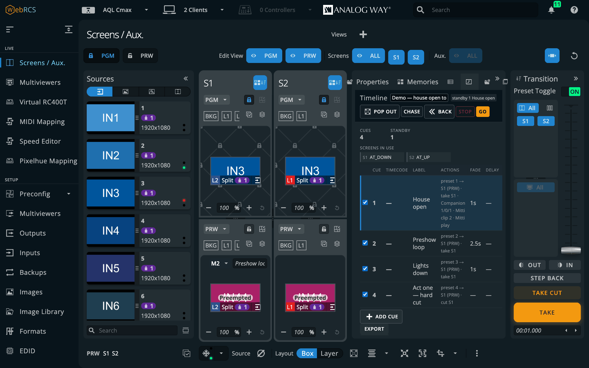

- **Edit** — the Screens / Aux. page with one row instead of two, and that row is a *programmer*:
  a buffer that is on neither preview nor program. Build a look with the same sources, the same
  layer parameters and the same memory bank, and the switcher sees none of it until you save it
  into a memory.
- **VPU Map** — the device's mixing-resource allocation, drawn as a budget: which units are
  fitted, who holds them, what is spare, and what a staged preconfig would change.
- **Console** — a lighting-desk command grammar for a video switcher, which also takes raw AWJ,
  store writes and OSC addresses — and, on a Midra 4K or Alta 4K, routes audio.
- **Timeline** — a theatre-style cue stack that advances on one GO, with per-cue fade, delay and
  follow times — and cues that fire from MIDI Time Code, LTC or a pushed timecode.
- **Memories** — every memory bank in one searchable list, showing which buffer holds each one.
- **Layer** — all 67 of a layer's properties, from the switcher's own catalogue; and names for
  layers, which the switcher has nowhere to keep.
- **Layer Groups** — several layers, on one screen or on many, driven as one; a ganged group
  follows a source change made to any member, wherever it came from.
- **Layer Lock** — a take that leaves chosen layers where they are, or takes one layer (or one
  group) alone — neither of which the switcher can do by itself.
- **Preview lock during takes** — the vendor's own PRW padlock shut while a screen transitions,
  so a memory recalled straight after TAKE is refused instead of riding the take onto program.
- **Send to** — a `…` on every source card that routes it to a screen and layer, or to a whole
  group, in preview or program, without a drag.
- **Matrix Routing** — patch the frame's own SDI and HDMI sockets to ports on a Blackmagic
  Videohub, a Lightware or a Turtle AV router, and route through it from the panel, a cue, the
  Console or OSC.
- **Audio Matrix** — the frame's audio channel matrix as a crosspoint grid: inputs and Dante
  onto outputs, Dante and multiviewers, by blocks of eight or by single channels.
- **HyperDecks** — Blackmagic HyperDecks, and Mitti through its HyperDeck control, played, cued
  and recorded from the panel, a cue or OSC; linked to the input they feed, with rules that play a
  deck when it goes on air, load its next clip when it comes off, and take when its clip ends.
- **Companion** — a Bitfocus Companion linked to this app: its buttons drawn and pressable here,
  a Companion trigger on cues and memory recalls, its own editor on the same address as Web RCS,
  and a panel that knows which switcher you are on and offers to add the connections that belong
  in the show.
- **EDID builder** — EDIDs made beside the EDID bank and saved straight into it: one per custom
  format, automatically if you like, or by hand in the full Otter editor.
- **Pitch Compensation** — the H and V ratios a screen spanning LED walls of different pitches
  needs, worked out from the pitches you give it.
- **OSC input** — QLab, TouchOSC, a lighting desk or Companion driving the switcher over UDP, with
  no browser open.
- **MIDI Mapping** — a control surface driving the switcher, from the page itself.
- **Speed Editor** *(preview)* — a DaVinci Resolve Speed Editor as a switcher panel, plugged into
  the machine this app runs on: CAM 1–9 pick sources, CUT and DIS cut and take, and the wheel
  moves opacity, position and size. Any browser, with DaVinci Resolve quit.
- **Pixelhue panel** *(preview)* — a Pixelhue U5, U5 Pro or U5 mini driving the switcher, with
  **Pixelhue Mapping** to give any key, fader or encoder a different job.
- **Background Slicer** *(preview)* — one picture cut into a pixel-exact background for every
  output of one or more screens, uploaded and put into a background set; or each output fed live
  from an input, with the output map for the media server behind it. Off until you switch it on.
- **Thumbnail relay** and **Multiviewer thumbnails** *(preview)* — lighter source thumbnails, or
  live ones cut from a multiviewer. Both off until you switch them on.
- **Remote access** — the app served over Tailscale (with a real HTTPS certificate) or ZeroTier,
  without binding it to the venue LAN.
- **Your setup in one file** — cue stack, groups, layer names, router patch and settings, saved and
  restored together.
- **Arithmetic in the vendor's own numeric fields** — type `1080-80` into a layer width and get
  1000.

Every one of these is a **plugin**: any of them can be switched off, and you can add your own —
see [Switching features off](#switching-features-off).

The panels ride the vendor app's own WebSocket. **No second Web RCS connection to the device, no
replacement UI, and nothing to install in the browser.** OSC input, the Pixelhue panel and the Edit
page's direct save each open a brief AWJ connection of their own when they act — worth knowing,
because the switcher allows five AWJ clients at once.

> **Before you rely on this:** the panels render inside a real Web RCS session and the device store
> mirrors live — verified through this proxy against **LivePremier Simulator 6.2.73**, along with
> cue-stack persistence and the whole setup flow. The VPU map has been **read from a live Aquilon
> C** and is tested against that capture, including Optimized mode, interleaved output links, and a
> staged preconfig differing from the running one.
>
> **Midra 4K and Alta 4K (QuickVu, Pulse, Eikos, QuickMatrix, Zenith 100/200) are supported
> since 0.6.0** — Timeline, Console, Memories, Layer and Pitch Compensation; there is no VPU to map
> on those and MIDI Mapping is not offered there yet. The port was proven on a **live Pulse 4K**:
> every write over the device protocol by a test harness, and the Console panel's own lines typed
> by the operator — the first writes this app's panels have made to real hardware. On LivePremier,
> nothing has been written to a physical device yet and the timeline has only ever fired at a
> simulator.
>
> **The Edit page and Companion (0.10.0, 0.11.0) have been proven on simulators and a running
> Companion 5.0.5, not on a physical switcher.** Two of their limits are worth knowing now: the
> Edit page's *direct* save hands the switcher a file path that the switcher resolves, so it is
> unproven on real hardware — its *via preview* route works anywhere — and Companion cannot add the
> LivePremier Plus connection until a Companion module for this app exists. The **Pixelhue panel**
> has never met a console at all.
>
> **0.13.0 rebuilt every feature as a plugin.** Each was checked against the simulator and a
> Videohub emulator as it moved; what each one does did not change. A plugin of your own runs with
> the same access to the switcher as the app itself, so switch on only what you trust.
>
> **0.14.0 adds the Thumbnail relay and placeholder routers**, both proven on the simulator only.
> The relay is off until you switch it on.
>
> **0.15.0 adds Layer Lock, HyperDecks, the EDID builder, Mosaic inputs, Pixelhue Mapping and the
> Speed Editor**, all proven on the simulator (and emulated decks and panels) only — none has met
> real hardware yet.
>
> **0.16.0 adds Audio Matrix, Remote access and Multiviewer thumbnails, and the Speed Editor works
> on a real panel** — through the app's new device host, over USB. Audio Matrix and Multiviewer
> thumbnails are proven on the simulator only.
>
> Built with AI assistance, directed and reviewed by a human author.

---

## Running it

Needs **Node 20 or newer** and has no dependencies to install.

```bash
npm start
```

Then open `http://127.0.0.1:8535/` and give it the switcher's address. That address is remembered.

```bash
npm start -- --device 192.168.2.142
```

| flag | meaning |
| --- | --- |
| `--device <host[:port]>` | the switcher. Port defaults to 80 (a simulator is usually `:3000`). |
| `--port <n>` | local port to listen on (default 8535) |
| `--host <addr>` | local address to bind (default `127.0.0.1`). Bind a LAN address or `0.0.0.0` to reach it from other machines. On the machine running it, keep using `http://127.0.0.1:<port>/` — that is the address browsers treat as secure, which MIDI Mapping and the timecode sources need; a local browser that arrives by the LAN address is sent there automatically. Other machines get everything except those. |
| `--data <dir>` | where cue stacks are kept |

There is a desktop app too — a tray launcher with an interface and port picker.

### In Docker

An image is published to `ghcr.io/stoatworks-labs/livepremier-plus` on every change to the main
branch. `:latest` is the newest of those, which can be ahead of the last release; each image is
also tagged with its commit, so a release can be pinned by the commit its tag points at.

```bash
docker run -d -p 127.0.0.1:8535:8535 -v "$PWD/config:/config" \
  ghcr.io/stoatworks-labs/livepremier-plus:latest
```

The repo's `docker-compose.yml` does the same with `docker compose up -d`, **but it publishes the
port on every interface of the host** — change `8535:8535` to `127.0.0.1:8535:8535` unless the whole
network is meant to reach it (see *On binding wide* below). `./config` keeps your cue stacks and the
remembered switcher; set `LPP_DEVICE` to skip the setup page.

> **On binding wide.** The default is loopback for a reason: **this proxy is an unauthenticated
> route to a switcher's entire control surface** — and, once a Companion is linked, to that
> Companion's admin UI too. `--host 0.0.0.0` hands that to everyone on the
> network. Do it deliberately, not by habit.

### From another machine: Tailscale or ZeroTier

**Preconfig ▸ LivePremier Plus → Remote access** serves the app to a Tailscale tailnet or a ZeroTier
network while it stays bound to loopback on the venue LAN. Both are off until you switch them on.

- **Tailscale, HTTPS** — `https://<machine>.<tailnet>.ts.net/`, through `tailscale serve`, with a
  real certificate. Because it is HTTPS, MIDI and LTC input work from the remote browser too. Switch
  HTTPS certificates on for the tailnet once (admin console ▸ DNS); the first load after that waits
  about 15 seconds while the certificate is issued.
- **Tailscale, plain http** — `http://100.x.y.z:<port>/`, a listener on this host's tailnet
  addresses only. No MIDI or audio input from there.
- **ZeroTier** — `http://<zerotier address>:<port>/` on every network this host is authorised on.
  `zerotier-cli` has to be able to read the service's auth token.

Switching Tailscale off, or stopping the app, removes the `tailscale serve` entry it made. Joining and
leaving networks from the card is offered only when the app was started with `--appliance` — on a
laptop, its networks belong to its owner.

> ⚠️ **Neither network is a login, and this app has none.** Everyone who can reach the host can
> drive the switcher; who can reach it belongs in the tailnet's ACLs or the ZeroTier controller's
> rules. The README has the full table, and what to do in Docker.

### Open it through the proxy, not at the switcher

**If you open the switcher's own address directly, the panels are not there and MIDI will not
work.** Web MIDI is a secure-context API; `http://127.0.0.1:<port>` counts as one and a plain-HTTP
LAN address does not. The panel says so rather than failing silently.

---

## Edit — programming a look off the buses

**PLUS ▸ Edit.** The Screens / Aux. page, with one row per destination instead of two. Sources on
the left, the destinations in the middle, the layer panel on the right — the vendor's own layout,
so everything is where you already look for it. The difference is the row: it is marked **EDIT**
in amber rather than PGM in red or PRW in green, because it is on neither bus.

**Nothing you do here reaches the switcher.** There is no TAKE, no T-bar and no padlock, because
there is nothing to transition and nothing to protect.

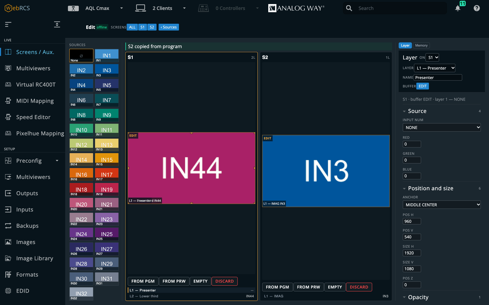

### Building a look

Each card starts empty. Three ways to fill it, and none of them asks the device for anything:

| | |
|---|---|
| **From PGM** | copy what is on air into the programmer |
| **From PRW** | copy what is cued |
| **Empty** | every layer full-frame with no source, which is what an untouched preset looks like |

Then work the way you would on the real page:

- **click a layer** on the card, or a row in the strip beneath it, to select it;
- **drag it** to move, or take one of the eight handles to resize — the numbers land in the Layer
  panel as you go, clamped to the switcher's own limits;
- **click a source** on the left to put it on the selected layer;
- **Layer** on the right is the full parameter set — all sixty-seven of them, the same panel the
  vendor's tab strip carries, pointed at the programmer.

**Discard** forgets a destination's buffer entirely; **Empty** keeps it and clears it.

### Saving it into a memory

The **Memory** tab is the one control on this page that touches the switcher. Name a slot, give it
a label, and choose a route:

- **Direct** — writes the memory bank itself. No preset buffer is written and no take is fired, so
  neither preview nor program moves. This needs the switcher to be able to read a file this app
  writes, which it can when both are on the same machine — a simulator, or an installation where
  the **Shared directory** under *Saving memories from the Edit page* (Preconfig ▸ LivePremier Plus)
  points at a share they both see.
- **Via preview** — puts the look into the preview buffer, fires the switcher's own save, then puts
  preview back property-for-property. **Program never moves.** Preview shows the look for about a
  second, and afterwards the bank will call it *modified* even though the content is identical —
  the switcher is right that the buffer was written to. Refused while a take is in flight. This
  route works on any switcher, and it is the only one on Midra 4K and Alta 4K.

**Load into the programmer** reads a slot back the other way. A memory's contents are not in the
device's own data — a slot only publishes its name, its canvas and what categories it holds — so
reading it out is the only way to see inside one, and it is how you pick up yesterday's look and
change it.

---

## VPU Map

**PLUS ▸ VPU Map.** A LivePremier configuration either fits the mixing resources the chassis has or
it does not, and the switcher's own interface only tells you which by refusing it. This draws the
budget instead: which VPUs are fitted, which screen holds which mixers, and what is spare.

Each VPU is drawn the way Analog Way's own manual draws one — an 8 × 8 field of links, layer links
coming in from the left, output links running down from the top — so the picture matches the
documentation you already have:

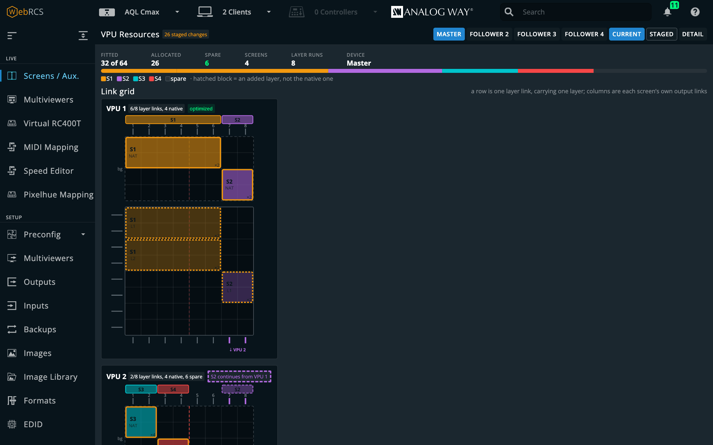

- **Native layers** sit in a band above the field, because a native is the bottom of the stack.
- **A screen that ran out of mixers** and continued onto another VPU has the two cards stacked, with
  the link drawn straight down out of one and into the next.
- **The header over the columns** names each link's screen, and its region and output plug where
  the switcher's own output figures add up.

**Current** and **Staged** switch between the running configuration and the one waiting in
Preconfig, and a count says how many changes applying it would make — including a layer moving
onto different links with every other value identical, which is still a change.

It only reads. Nothing on this page writes to the switcher. It is LivePremier only: a Midra 4K or
Alta 4K has fixed processing rather than allocated mixers, so there is no budget to draw and the
entry is not there.

---

## Console

Verb first, then objects, innermost scope last. Every keyword abbreviates to any unambiguous
prefix; **Enter executes and nothing is sent before it.**

```
Recall Screen 1 Memory 5
R Sc 1 Th 4 Me 5 Pre          the same command
Store Master 12
Take Screen 1
```

The line **parses as you type and shows what it will do** — `Recall 3 → Screen 1 Preview` — before
anything reaches the device. Tab completes; ↑ recalls history.

**Variables** go wherever a number does — `Set Screen 1 Layer 2 Size ($S1.width / 2) $S1.height` —
and the feedback names what each one reads before Enter. Sums go in brackets. See
[Variables](#variables).

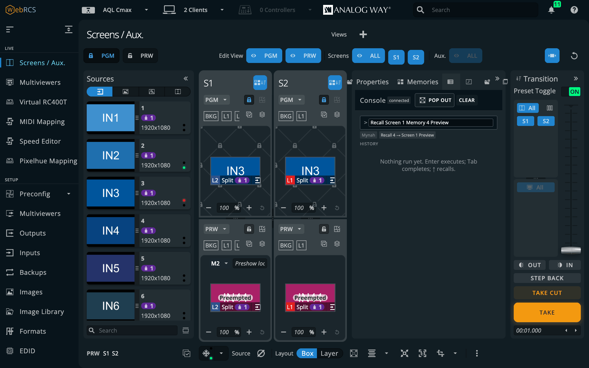

**This panel owns no grammar.** Every token, rule and device path comes from
[mynah](https://github.com/stoatworks-labs/mynah)'s own build output — the same artefact its
Companion module vendors. **If a command means the wrong thing, the fix is in mynah.**

That is worth more than tidiness: mynah's compiler and this repo's command builder were arrived at
independently, and they emit **byte-identical** store paths for the commands both know. Two
independent derivations agreeing is the strongest evidence either is right, and it stays true only
while nobody re-types the grammar here.

---

## Timeline

**Screens / Aux. ▸ Timeline.** A lighting desk's cue stack, driving a switcher: a numbered list
that advances on one **GO**, where each cue recalls memories onto screens and takes them.

Each cue can carry:

| | |
|---|---|
| **fade** | its own transition time, written to the screen before the take |
| **delay** | wait this long after GO before firing — a second GO during the wait fires it at once |
| **follow** | after this cue fires, fire the next one by itself, after a follow time you set |
| **timecode** | fire when incoming timecode passes this point (below) |
| **Companion trigger** | press these Companion buttons as the cue fires — see *Companion* below |

A few things behave the way a desk does rather than the way a switcher does:

- **GO fires the standby cue, then advances.** **BACK** moves the pointer only.
- **The switcher's own STEP BACK is a separate, clearly-labelled button**, because it restores the
  device's previous state rather than replaying a cue, and the two differ as soon as a cue does
  more than recall and take.
- **A cue is sent, never confirmed.** The switcher answers recalls and takes with silence, so the
  log says what left this app and the device status is shown separately.

The editor pops out into a window of its own — useful on a second monitor while the stack runs.
Select a cue there and everything it carries is editable below the list: number, timecode, name,
fade, pre-wait, follow, notes, the Companion buttons it presses, the HyperDeck commands it sends,
and its actions.

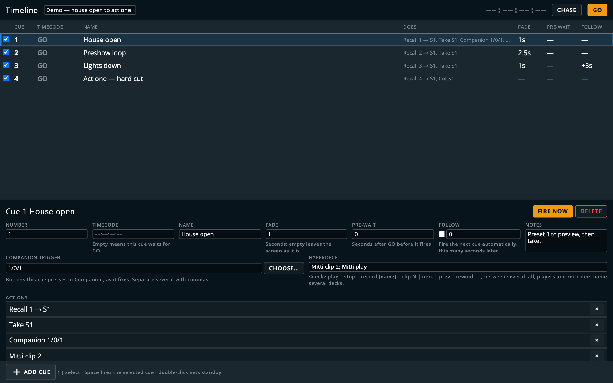

### Firing cues from timecode

Choose a source under **Preconfig ▸ LivePremier Plus → Timecode**:

- **MIDI Time Code** from any MIDI input the browser can see;
- **Audio (LTC)** from an audio input on this machine;
- **Pushed to LivePremier Plus** — anything that can POST a timecode to this app: a generator on
  another machine, a lighting desk, a script.

A cue fires **once per pass**, not on every reading. **Going backwards re-arms** it, so the same
scene can be rehearsed twenty times. **Jumping forward does not run everything it skipped** — the
cues in between are marked done, silently, and the show carries on from the new position, rather
than firing a hundred takes in a second.

---

## Memories

**PLUS ▸ Memories.** Every memory bank in one list: master, screen and layer on a LivePremier;
master, screen and aux on a Midra 4K or Alta 4K. Search by name, rename in place, and see which
preset buffer is holding each memory right now — and whether it is still unmodified.

- **A recall names its target every time.** Pick **PRW** or **PGM** before you recall; there is no
  default, and program is coloured like the risk it is.
- **Save and erase** do what the vendor's own buttons do, and the page says which save filters the
  switcher will apply before you press it.
- **It pops out** onto a second monitor, which the vendor's own Memories tab cannot do.

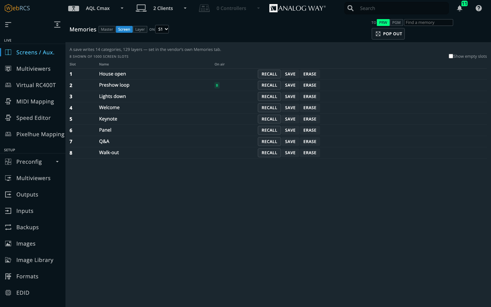

Click a name to rename it; **Enter** saves, **Esc** backs out.

---

## Layer

**Screens / Aux. ▸ Layer.** Every one of a layer's 67 properties — source, position, size, opacity,
cropping, border, transitions, effects, masks and keying — generated from the switcher's own
parameter catalogue, so a firmware that adds a property grows a field for it.

You name the destination, the buffer and the layer outright, rather than the panel following what
you clicked: that is React state inside the vendor's page and cannot be read, and on a second
monitor a panel that stays where you pointed it turns out to be the better behaviour anyway.

- **The buffer is shown resolved**: PRW means "whichever letter is preview right now", and the
  panel says which letter that is. A buffer that is on air is banded in red.
- **Mid-take, it refuses to write to PRW or PGM**, because neither names a buffer honestly while a
  transition is running. A literal letter still works.
- **It pops out** into its own window.

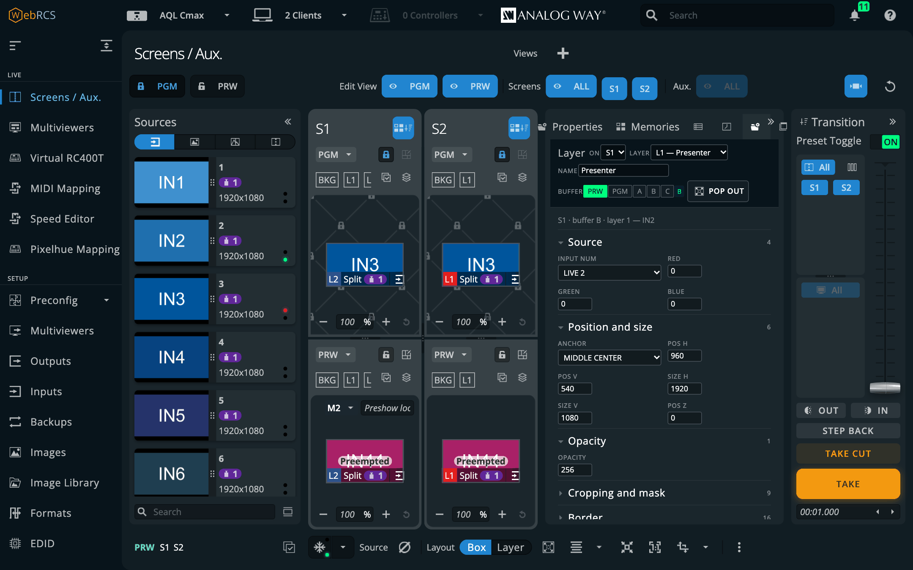

### Naming a layer

Type a name into **Name** and it appears everywhere a layer is listed — this panel, the groups, the
`…` menu, and **the vendor's own layer lists**. The switcher has no field for a layer name, so this
app keeps it, per switcher; anything that talks to the switcher directly will not see it.

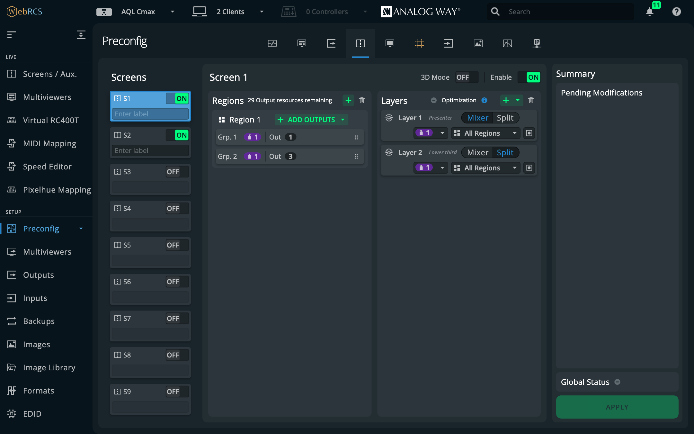

---

## Layer Groups, and the `…` on a source card

**PLUS ▸ Layer Groups.** A group is a name and a list of layers, on one screen or on several —
layer 2 on screen 1 with layer 1 on screens 2 and 3 is *the side screens*. Add a layer with the
destination and layer pickers at the bottom of each group card; the layer list is the device's own
**fitted** list, so a slot the hardware has not got is never offered.

The two source columns beside each member show what it is showing now, in program and in preview,
so a glance says whether the group agrees.

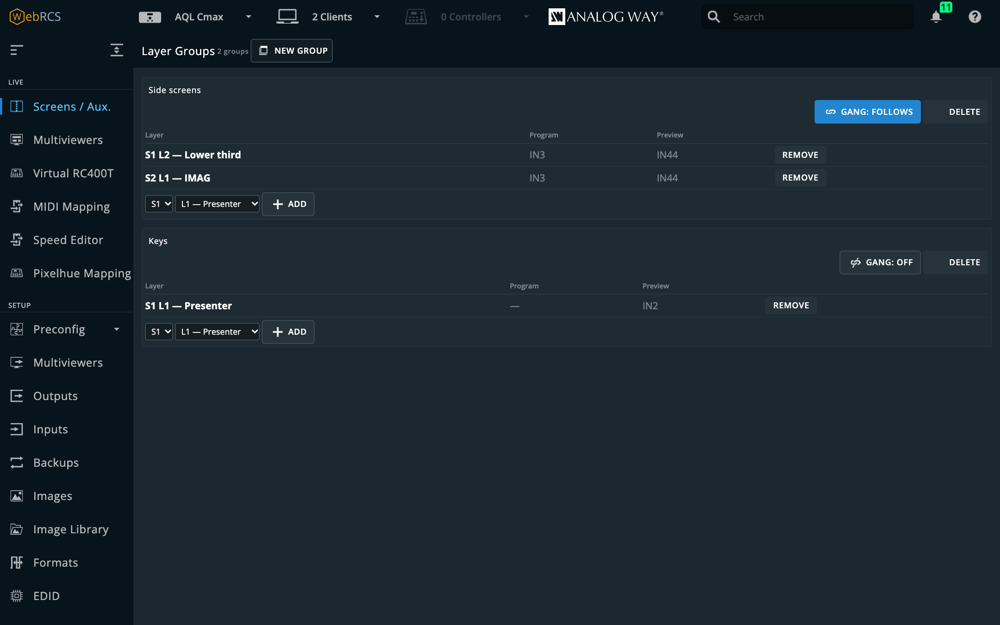

**Gang: follows** is on by default. The rest of the group is written to match whenever any member's
source changes — by the `…` menu, by the vendor's own drag-and-drop, by a memory recall, by another
client. Turn it off and the group stays useful as a target and does nothing on its own.

A layer belongs to **one group at a time**; adding it somewhere takes it out of where it was, and
the panel says so.

### Sending an input

Every source card in the Sources panel gets a **`…`** beside the vendor's own `⋮`. The `⋮` is
theirs and opens that input's settings; the `…` is ours and routes it.

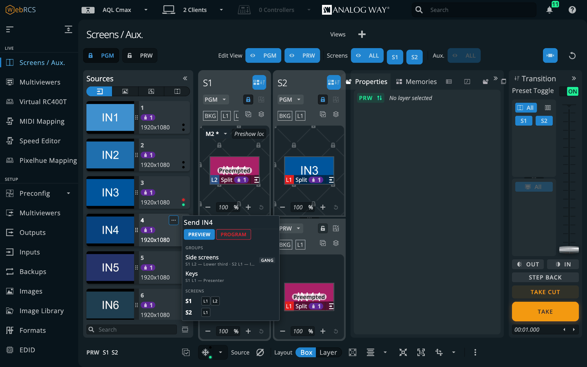

Preview and program mean the **role**, resolved per screen at the moment you click. Two screens
sitting on opposite preset letters — which is normal — still both get it in the right buffer.

**The PGM padlock is respected.** With program unlocked on the screens involved, a program send
goes through on one click. With it locked, you get a step naming every layer it is about to change
and asking. A screen you have not got on the page has no padlock to read, so it is treated as
locked and asked about too.

> Mid-take nothing is sent. While a transition is in flight, "program" and "preview" do not name a
> buffer honestly, and the menu says so rather than guessing.

Groups are kept **per switcher**, beside the cue stack. Point the app at a different frame and you
get that frame's groups.

---

## Layer Lock — a take that leaves a layer alone

**PLUS ▸ Layer Lock.** One card per screen or aux, one row per fitted layer, each with **Lock** and
**Take only**. When Layer Groups is on, each group gets the same two buttons at the top.

The switcher has no per-layer take: TAKE swaps the whole program and preview buffers. What this uses
instead is that **a layer that is the same in program and preview has nothing to transition.**

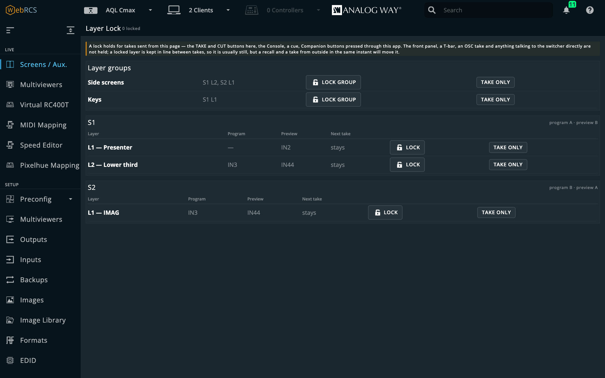

- **Lock** keeps the layer's preview copy equal to its program copy. Change it in preview — the
  vendor's properties, a memory recall — and it is put straight back; change it on program and
  preview follows. Every TAKE and CUT sent from this page, the vendor's own buttons included, is
  held for the few milliseconds it takes to line a locked layer up if it has drifted, then sent.
  Locks are kept per switcher and survive a reload.
- **Take only** takes that layer (or that group, on each of its screens) alone: every other layer
  on the screen is set equal to program, the take is sent, and once it has landed the other layers'
  preview looks are put back into what is now preview. A locked layer cannot be taken this way —
  unlock it first.

**Next take** is the switcher's own word for what each layer will do on the next take —
*stays*, *opens*, *closes*, *crosses*, *flies*. On a real frame, *stays* beside a locked layer is
the switcher agreeing. A simulator says *stays* for every layer whatever the buffers hold.

> ⚠️ **Only takes sent from this page are held.** The front panel, a T-bar, an OSC take, a
> Companion button speaking AWJ straight to the switcher and another operator's browser go straight
> to the switcher. Between takes a locked layer is kept in line, so it usually stays put anyway —
> but a recall and a take from outside in the same instant will move it. The panel says this at the
> top every time.

> ⚠️ **Proven on the simulator only.** No real frame has yet been asked what it does with a locked
> layer that has a live source on it. The first time you use this on a frame, lock a layer in
> rehearsal, take, and watch it.

---

## Preview lock during takes

**Off until you switch it on** in Preconfig ▸ LivePremier Plus → Plugins; its card is on the same
settings page.

Press TAKE, then recall the next memory into preview before the take has finished, and the memory
does not wait: while a transition runs, the buffer the switcher calls *preview* is the one fading
up onto program, so the recall lands in the picture going to air.

Web RCS already has the guard rail for this — the **PRW padlock** on each screen card. This feature
presses it for you:

- When a take starts on a screen — TAKE sent from this page, or a transition reported by the
  switcher from anywhere (front panel, T-bar, Companion, OSC) — that screen's PRW padlock is shut.
  A TAKE from this page shuts it before the switcher has even answered.
- While it is shut, Web RCS refuses a memory recalled into that screen's preview, with its own
  warning (*Screen memory could not be loaded … because PRW is locked*). A screen memory loaded on
  several selected screens still loads on the ones that are not mid-take; a master memory that
  includes a screen mid-take is refused whole, with Web RCS's master warning (read from its code,
  not yet tried).
- When the take lands, the padlock is opened again. A take that never starts is let go after a
  second and a half.

It is careful with your own padlocks: one you had shut before the take stays shut, and one you open
mid-take is left open. The card lists the screens it looks after (untick one to leave it alone),
what is mid-take now, and the last few things it did.

**This app's own recalls wait rather than being refused.** The padlock only stops Web RCS's own
buttons, so with this switched on the app holds its own recalls back itself:

- **Timeline cues.** GO on a cue that recalls into a preview that is mid-take, and the cue waits
  for the take to land and then fires whole — recall, fade and take in the usual order. The
  Timeline shows *waiting for take: 12 → S1* meanwhile, and **Stop** cancels it. Cues fire in the
  order GO was pressed: GO twice quickly and the second waits for the first cue's take to land
  before it recalls, rather than loading over the look the first was about to take.
- **Recall in the Memories panel**, and a **Recall line at the Console** — the same: *waiting for
  the take to land*, then sent.
- A recall into **program** is never held: that is you saying *on air, now*.
- If the take has not landed by its take time plus three seconds — a T-bar parked half way, say —
  the recall is **not sent**, and the cue, panel or Console line says so. Sending it late, into the
  picture fading up, is the one thing this exists to stop.

> ⚠️ **Not held back:** Companion, OSC, the front panel and other browsers go straight to the
> switcher. And only screens whose card is drawn on the Screens / Aux. page can have their padlock
> shut; a screen whose card is not on the page when its take lands is unlocked the next time it is.

> ⚠️ **With Web RCS's remote selection switched on**, padlocks are shared between everyone
> connected, so run this in one browser only.

> Proven on the LivePremier simulator against Web RCS 6.2.73's own lock: a memory clicked into
> PRW while a screen was mid-take was refused for that screen and loaded on the other, and loaded on
> both once the take had landed. Not yet run on a real frame, nor on a Midra 4K or Alta 4K.

---

## Matrix Routing

**PLUS ▸ Matrix Routing.** Patch the switcher's own sockets to ports on an external router —
a **Blackmagic Videohub**, a **Lightware**, or a **Turtle AV** — and route through it from here.

You describe the **cable**, and the rest follows. The direction inverts, which is the thing that
reads wrong at first glance every time:

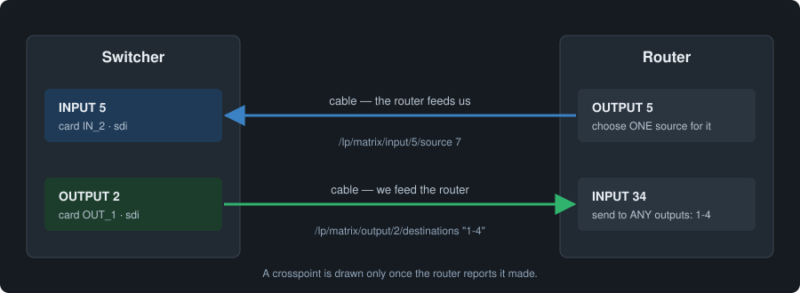

So a switcher input is fed by a router *output*, and a switcher output arrives at a router *input*.
The patch form says which of the two it wants as you fill it in.

**Set it up in three steps.** Add the router (name, protocol, address — the port follows the
protocol's own default). Patch each cable: pick a socket, pick the router, give the port number at
the other end. Then route.

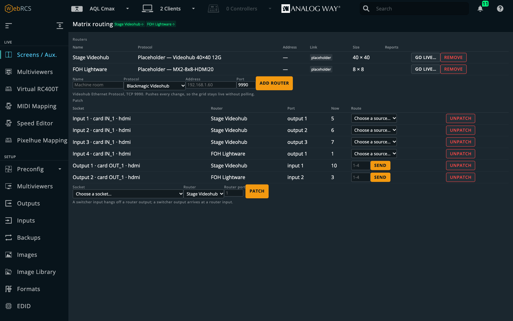

Sockets are named in the device's own words, because which connector "card 2, port 1" is depends on
a legend this app cannot see:

```
Input 13 · card IN_2 · connector IN_25 · sdi
Output 5 · card OUT_2 · hdmi
```

**The two route controls are different, and deliberately so.** An input row gets a source
dropdown — one choice, because a socket is fed by one router output, and it settles what that input
sees. An output row gets a destination field, because the signal arrives at one router input and
can go to any number of outputs at once: type `3`, or `1-4`, or `1,2,5-8`.

> ⚠️ **Sending adds; it never takes away.** Naming outputs 1-4 routes those four and leaves output 5
> alone, even if it was showing this source a moment ago. A router output always shows *something*,
> so "removing" a destination would mean choosing a different source for it — and there is no
> answer to which one.

**The Now column is what the router says, not what you asked for.** A click does not move the grid
until the router agrees, and it keeps up with changes made at the router's own front panel or by
another operator. A Videohub answers a route it will not make with an acknowledgement and the
unchanged crosspoints, so a panel that showed your request back to you would look right and be
wrong — during exactly the minute that matters.

### Placeholder routers — building before the rack

A router you have not got yet can still be patched and routed. Add it with **Protocol ▸
Placeholder (no hardware)** and pick its **Model** — Videohub, Lightware MX2 or MX-FR, Turtle AV,
or a custom size — and it behaves like the real one everywhere: the panel, the Router tabs, cues,
OSC and the Console all route through it. Nothing is on the other end; its crosspoints are kept
here as the router's **plan**.

When the rack arrives, **Go live…** gives it an address. The patch carries over, nothing is sent on
connect, and **Push plan** sends only the crosspoints that differ. A planned port past the real
frame's size is named, not dropped.

### On the input and output pages

You do not have to leave the socket you are working on. **Inputs ▸ an input** and **Outputs ▸ an
output** carry a **Router** tab beside Signal, Aspect and the rest, and **Preconfig ▸ Inputs /
Outputs** shows a **Router** box under the selected card's own boxes.

Each says which router port the cable is on — and if it is not patched yet, patch it right there —
then shows the router's ports twice: as a **grid of tiles** and as a **list** with the router's own
port names.

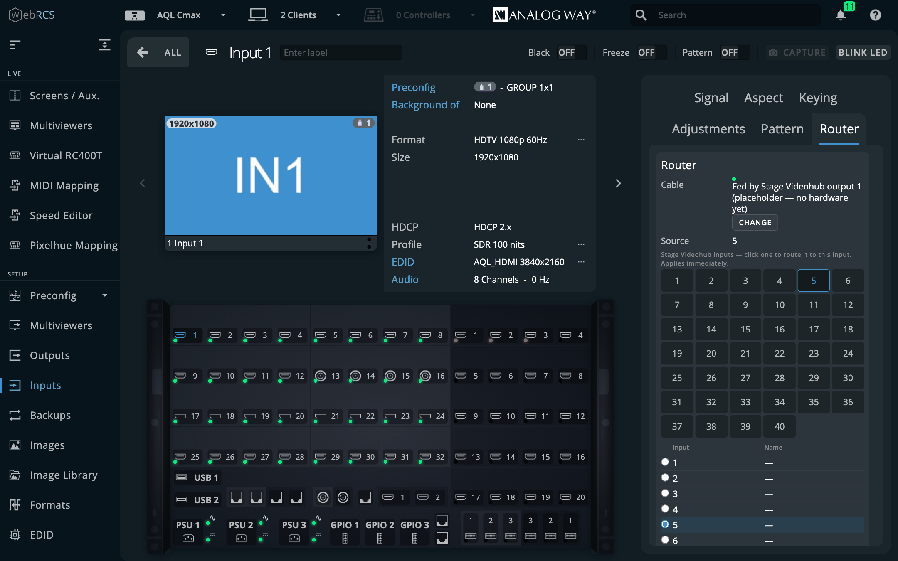

- **An input** picks one source. Click a tile or a row and it routes at once.
- **An output** picks any number of destinations. Clicking builds a selection (a dashed outline),
  and **Route** sends it. A solid blue tile is one the router already has on this output; the list
  shows what every other destination is showing now, which is what a route there would replace.

> ⚠️ **In Preconfig this is live, not part of Apply.** The route goes to the router straight away;
> Apply only concerns the switcher.

### From a cue, the Console and OSC

A cue can carry a matrix route beside its recalls and takes. It goes out ahead of the take, so the
signal is there before anything switches to it.

> ⚠️ **A cue does not wait for the signal to lock.** An SDI reclock is quick; an HDMI or HDCP
> handshake through a router can take a second or more, and nothing reports when it is done. A cue
> that routes and takes in one breath can take to black — put the route in an earlier cue when the
> format may change.

The same three addresses work typed at the Console and sent over OSC:

```
/lp/matrix/input/5/source        7        switcher input 5 now sees router input 7
/lp/matrix/output/2/destinations "1-4"    switcher output 2 out of router outputs 1-4
/lp/matrix/hub/route/3           9        router "hub": output 3 takes input 9
```

The routers are kept for the **installation**, not per switcher — a Videohub does not move when you
fail over to a backup frame. The **patch** is per switcher, beside the cue stack, because it
describes that frame's own sockets.

> **What has been proven, and what has not.** The Videohub driver was driven end to end against a
> working implementation of the protocol, including the crosspoint numbering, which counts from
> zero on the wire and from one everywhere you can see. **No real Videohub has been in the loop.**
> The Lightware and Turtle AV drivers are written from their vendors' protocol documents and
> **have never spoken to the hardware at all**. `docs/MATRIX.md` gives a short procedure for
> proving each on your own kit before a show.

---

## Audio Matrix

**PLUS ▸ Audio Matrix** (LivePremier only). The frame's audio channel matrix as a crosspoint grid:
sources down the side — inputs and Dante — and destinations across the top — outputs, Dante and
multiviewers.

The whole matrix is 576 source channels by 272 destinations, far more than anyone can read, so it
opens as **blocks of eight**. A block says how many of that destination's channels come from that
source, and is solid when it is exactly 1→1 … 8→8. **Click a block** to lay the source across the
destination channel for channel, or to clear it when that is what is there. Click a row or column
header to **open it into its eight channels**; where an open row meets an open column, each cell is
a single crosspoint.

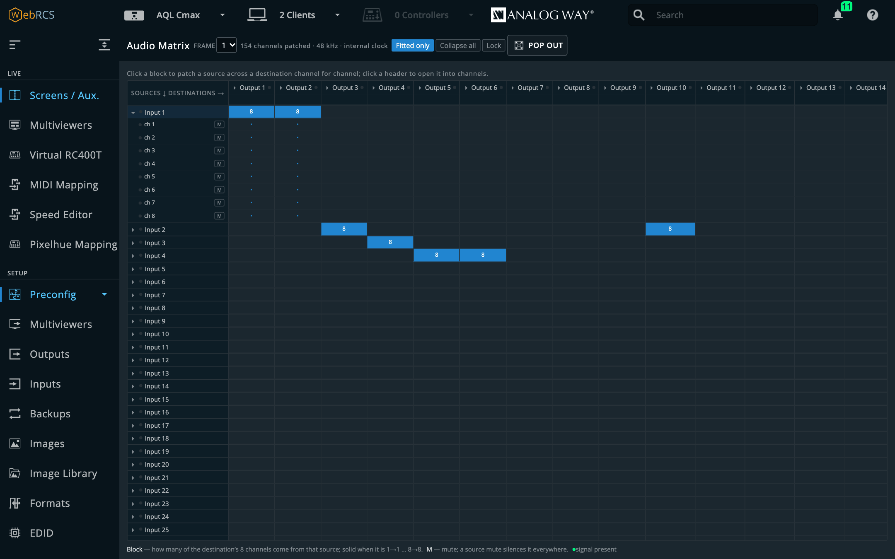

- **What is lit is what the switcher reports**, not what was clicked. A click marks the cell as
  pending; the switcher's echo lights it, and a write it never echoes is named in the note line.
- **M** mutes a destination channel, or a source — a source mute silences it everywhere. A dot beside
  a name means signal is present.
- **Fitted only** hides the inputs and outputs this frame has no card for — anything patched is
  always shown; **Collapse all** closes every open row and column.
- **Lock** stops clicks from patching, for a matrix that is live on a show: groups still open and
  close.
- **It pops out** — a matrix is wide and the sidebar is not.

The Console's `Set Audio Patch Input 3 Channel 1 Thru 8 To Output 1` is the same write as a click.
On a Midra 4K or Alta 4K there is no channel matrix and the entry is not offered; audio there is
routed from the Console.

> Proven on the simulator only.

---

## HyperDecks

**PLUS ▸ HyperDecks.** Blackmagic HyperDecks — and anything that answers their protocol, Mitti
included — played, cued and recorded from the switcher's own UI, and made to follow the show.

1. **Add a deck** at the foot of the panel: a name, its address, port 9993, its kind (HyperDeck,
   Mitti, or other) and its role (player, recorder or both). For Mitti, switch HyperDeck control
   on in Mitti's own preferences first.
2. Open **Settings and rules** on its card and pick the input it **plays into** — the plug on
   the back of the frame its output is cabled to. A recorder can name the output that **feeds**
   it.
3. Its card now shows what the deck is doing — clip, elapsed, remaining, **ON AIR** / **PVW** —
   and drives it: Prev, Top, Play, Stop, Next, a clip to cue, and Record on a recorder. **Record
   all** and **Stop recorders** are in the toolbar.

   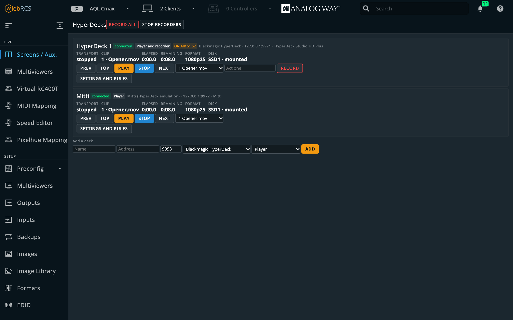
4. Tick **Follow the switcher** and choose what happens when its input is put on program (play),
   put in preview (rewind), taken off (pause, rewind or load the next clip), and when a clip ends
   (take or cut the screens it is on air on, optionally a few seconds early so the mix lands on
   the last frame). Tick screens to narrow it; none means all.

> **The rules run in an open page.** One page at a time runs them — the panel says which — and a
> page that starts running them acts only on what changes after, so opening one never plays a
> deck that is already on air. With no Web RCS page open, the buttons, cues and OSC still work,
> but nothing follows the switcher.

In a cue, the **HyperDeck** field takes `VT 1 clip 3; VT 1 play; recorders record Act 1`. Over OSC,
`/hyperdeck/<deck>/play` and the rest — docs/OSC.md.

> ⚠️ **Written from Blackmagic's published protocol and proven against an emulation of it — not
> yet against a real HyperDeck.** `docs/HYPERDECK.md` has a short procedure for proving it on your
> own deck before a show.
>
> **Mitti needs the release after 0.16.0.** A real Mitti 2.8.18 answers `103 unsupported` to any
> command ending in a carriage return, which is how 0.16.0 ends them; the link now ends them with a
> bare line feed, which a HyperDeck also takes. Until that release, Mitti accepts the connection and
> refuses everything after it.

---

## Dante (preview)

**PLUS ▸ Dante.** The Dante audio network's routing — who is listening to what — read off the
devices themselves, beside the switcher it feeds. Off by default: switch it on in **Preconfig ▸
LivePremier Plus → Plugins**, then reload.

> ⚠️ **Preview: it has never been run against a real Dante device.** Its protocol code is held to
> packets Dante Controller itself sent, and everything else was proven against a simulated network.
> `docs/DANTE.md` has a short test to run with Dante Virtual Soundcard or the switcher's own card
> before you trust it with a show. Keep Dante Controller open beside it the first time.

### Finding the devices

Devices are found on their own: the app asks the network every 30 seconds, from a port of its own,
so Dante Controller and Dante Virtual Soundcard on the same machine are not disturbed. Under
**Settings ▸ Dante** you can choose which network interface to ask on, list devices **by
address** for a network where multicast does not reach this machine, and set how often each device
is read again (every 5 seconds by default — this is how a change made in Dante Controller shows
here).

### The grid

Receiving devices down the side, transmitting devices across the top. A block says how many of the
receiver's channels take from that transmitter, and is solid when it is channel for channel (1→1,
2→2 …). Click a device's name to **open it into its channels**; where an open receiver meets an open
transmitter, each cell is one subscription, coloured by what the receiver reports: blue for
connected, orange while it is being set up, red for unresolved or failed. Hover a cell or a channel
for the device's own words.

1. **Unlock** the grid (it opens **Locked**: clicks only open and close devices).
2. Click a cell to subscribe that receive channel to that transmit channel, or to clear it when it
   is already lit. Click a block to lay the transmitter across the receiver channel for channel, or
   to clear exactly that; past eight subscriptions it asks first.
3. The cell waits (dashed) until the device has been read back. The note line and **Last change**
   say what each device reports: *confirmed*, or why not.

**Filter** narrows the grid by name; **Routed only** hides the empty channels. **Devices**, under
the grid, lists each device's model, address, protocol revision, sample rate, latency and channel
counts, and says why one cannot be changed if it cannot.

**This switcher.** The switcher's own Dante card is found by the name in its store and marked
**this switcher**. Its receive channels show the outputs the **Audio Matrix** sends them to (`→
Output 7 ch 1`), and its transmit channels the input they carry. If it is not found — its Dante name
was changed, say — choose it under **Settings ▸ Dante ▸ This switcher's Dante card**.

### Dante Controller presets

- **Export preset** saves a Dante Controller preset of every device read. In Dante Controller,
  **File ▸ Load Preset** opens it like one of its own.
- **Import preset…** reads a preset saved by Dante Controller and shows, device by device, which
  subscriptions applying it would change — **including the ones it would clear**: as Dante
  Controller does, a receive channel the preset leaves empty, or does not list, is cleared. Each
  role in the preset is matched to a device by its id or name; pick another, or *not applied*, to
  change that. **Apply** sends exactly what was shown; if the network has changed since, it says so
  and shows the difference again.

Only subscriptions are applied from a preset — never names, sample rates, latency or network
settings. Dante Controller is the tool for those.

### Snapshots

Type a name and **Save current routing** to keep every receiving device's subscriptions. **Recall**
says how many subscriptions it would change, then changes only those, and lists anything it could
not do. Snapshots are saved in the setup file with everything else.

### From a cue, the Console and OSC

In a cue, the **Dante** field takes `snapshot Show A`, or `1@Amp-1 <- Mix L@Desk` to subscribe
receive channel 1 of Amp-1 to Mix L on Desk, or `Front L@Amp-1 <- none` to clear one; `;` between
several. Over OSC or at the Console: `/lp/dante/snapshot/Show-A/recall`,
`/lp/dante/route/Amp-1/2 "Mix R@Desk"`, `/lp/dante/clear/Amp-1/2` — the full list is in
`docs/OSC.md`.

---

## Companion

**PLUS ▸ Companion.** A [Bitfocus Companion](https://bitfocus.io/companion) (5.0 or newer) linked to
this app: its buttons drawn and pressable here, a cue or a memory recall that presses them, and its
own editor served on the same address as Web RCS — no second port to allow through a firewall.

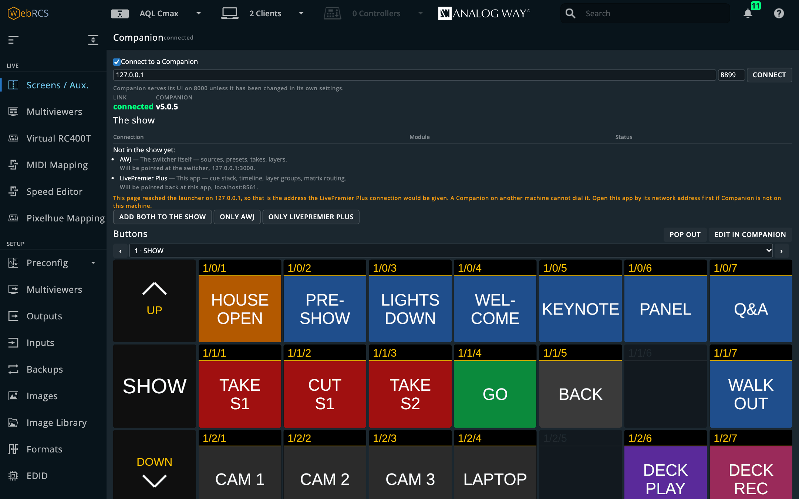

### Connecting

Tick **Connect to a Companion**, give its address, and press **Connect**. The port is Companion's
own admin port — 8000 unless it has been changed in Companion's settings. The link is off until you
turn it on: an app that reached for a machine on the show network the moment it started would not
be one you could reason about.

### What is in the show

The panel lists the show's connections — label, module and status — and **follows them live**, so
a connection added or disabled in Companion (including in its editor, opened from here) shows up
without a reload. The two it has an opinion about are highlighted:

- **AWJ** — the switcher itself: sources, presets, takes, layers.
- **LivePremier Plus** — this app: cue stack, timeline, layer groups, matrix routing.

What it does with them is an **offer, never a sync**:

- a connection already in the show is **used as it is** — its settings are left alone, whatever it
  is labelled;
- two of the same module is **reported, not resolved** — a show with a main and a backup frame is a
  correct show, and the panel will not pick one for you;
- a missing one is listed under **Not in the show yet**, with the address it would be pointed at,
  and **Add … to the show** creates it and configures it for the switcher you are on. Nothing is
  written until you press it.

> **The LivePremier Plus connection cannot be added yet.** It needs a LivePremier Plus module in
> Companion, and there is not one yet — the panel says so in those words. The AWJ connection works
> today.

**If you opened this app on 127.0.0.1**, that is the address the LivePremier Plus connection would
be given, and a Companion on another machine cannot dial it. The panel warns you; open this app by
its network address first if Companion is somewhere else.

### Buttons

The panel draws Companion's pages as a grid, in this app's own look: each button exactly as
Companion renders it — text, colours, feedbacks, variables — and updated the moment it changes.
Press one and it is pressed in Companion; hold it and it is held, so a long-press or a *while held*
action behaves as it does under a finger. Pick the page from the list, or step through with ‹ and ›.
Dim buttons have nothing on them.

- **Pop out** puts the grid in a window of its own, for a second monitor or a touch screen.
- **Edit in Companion** opens Companion's own button editor in a new window, through this app, for
  programming a button. Everything you change there shows here at once.

The grid only runs while it is on screen: move to another panel and it stops asking Companion for
images.

### A cue that presses a button

Each cue has a **Companion trigger** field — in the cue editor (Timeline ▸ Pop out) and in the
Timeline tab's **New cue** form. Type buttons as `page/row/column`, the way Companion numbers them
(`1/0/3`; several separated by commas), or press **Choose…** and click one in the grid — nothing is
pressed while choosing. When the cue fires, the buttons are pressed alongside its recalls and ahead
of its take, the same moment a matrix route goes out. An address that does not read is refused and
the field says why.

The press goes through this app's own link, not the page: it works whether or not the Companion
panel has been opened, and whether or not Companion's *HTTP API* setting is on.

### A memory recall that presses a button

**Memory triggers**, at the bottom of the panel: choose a bank and a slot, the buttons to press,
and **Set**. From then on, recalling that memory presses them — from the Memories panel, a cue, the
Console or the vendor's own Memories tab. **Test** presses them now. One recall sent to several
screens at once presses once.

> **Only recalls made in this page are seen.** A memory recalled from the switcher's front panel,
> from Companion itself, or from a browser not going through this app presses nothing — this app
> has no way to hear about it. That is also why two open pages do not press the button twice.

Triggers are kept per switcher, beside the cue stack, and travel in the setup file.

> **Linking a Companion widens what this app exposes.** Everything below `/__lpp/companion` is
> Companion's admin UI, reachable by anyone who can reach this app. On the default loopback binding
> that is only this machine; see *On binding wide* above before you change that.

---

## EDID builder

**Setup ▸ EDID.** The switcher keeps a hundred custom EDID slots — the **EDID Bank** tab, ED1 to
ED100 — and has nowhere to make an EDID to put in them: it takes a file. This puts the
[Otter EDID editor](https://otter-edid.stoatworks-labs.com) beside the bank, so an EDID is built and
saved without a file changing hands.

### From your custom formats

**From Formats** is a third tab beside Default EDIDS and EDID Bank. It lists every valid custom format
in Setup ▸ Formats (M1–M16) with an EDID already built for it:

- **Every porch is kept.** The EDID is built around the format's exact timing, not re-derived from its
  resolution and rate. Where the raster is exactly a CTA-861 mode (1080p60 is VIC 16), the VIC goes in
  too, because consumer sources act on VICs; anything else is a detailed timing.
- **Its name** is the label you gave the format when it fits the EDID's 13 characters, otherwise
  `M3 1080p50` — it is what the bank card and every input show.
- **Save to ED…** puts it in the next empty slot. **Save N to the bank** does every one that is missing.
  **Edit…** opens it in the editor first. The download button saves the `.bin`.
- **Keep the bank filled** does it for you: whenever a format has no EDID in the bank, one is added to
  the next empty slot. It never overwrites a slot and never deletes one — a format you change leaves
  its old EDID where it was, because an input may be using it.

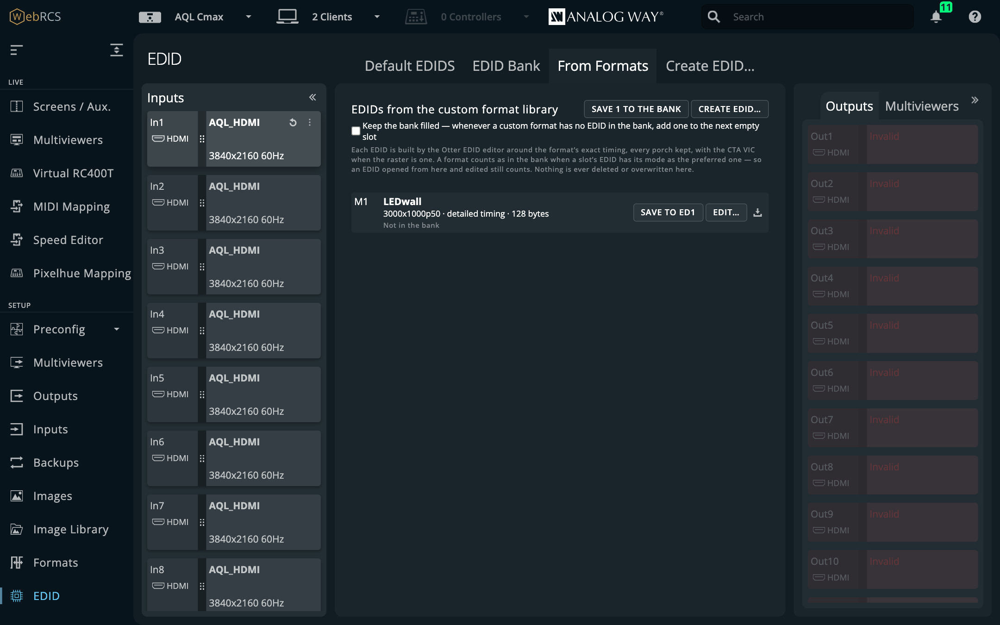

A format counts as *in the bank* when some slot's EDID has the format as its preferred mode — so an
EDID you opened from here, renamed and saved still counts, and the switch will not add a second copy
beside it.

> **The rate can read 0.01 Hz low.** An EDID states its pixel clock in 10 kHz steps, so a format whose
> clock falls between two steps comes back as the nearest: 3000x1000 at 50 Hz is 162.424 MHz, stored
> as 162.42, which the bank shows as 49.99Hz. Every porch is exact; it is the nearest rate an EDID can
> say.

### Creating or editing one by hand

**Create EDID…**, at the end of the same row of tabs, opens the full editor in a window of its own. An
**edit** tool on every filled bank card opens it on that slot. It is the same editor as the website:
Simple (a resolution and a rate), Advanced (every field), Mosaic (one tiled EDID per plug, so a Mac
bonds its outputs into one display), the signal cost, and which Analog Way, Barco and PixelHue inputs
will take it.

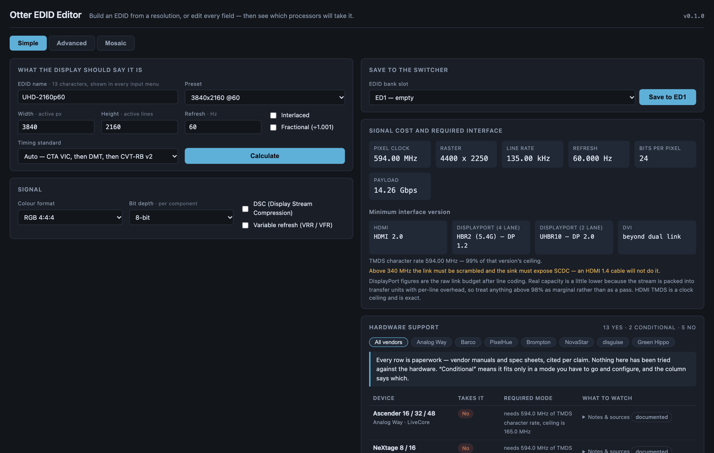

**Save to the switcher**, at the top right, writes it: pick the slot — it starts on the first empty
one, or on the slot you opened — and it says what it would replace before you press. A mosaic saves
its tiles into that many slots in a row, as their exact bytes — and **Apply to inputs** groups the
inputs 2 × 1 and loads each plug with the tile for its place.

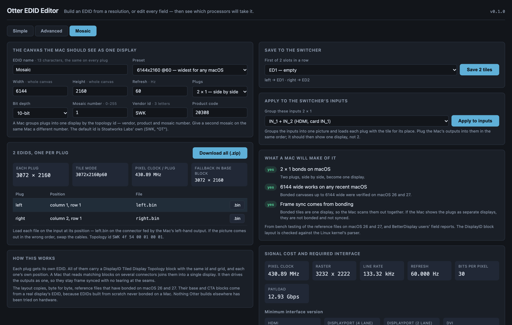

 The save finishes when the switcher
reports the new EDID, not when it accepts the request.

The window works through the Web RCS tab it came from, like every popped-out panel here; close that
tab and it says it can no longer save.

---

## Pitch Compensation

**Preconfig ▸ Pitch Compensation**, beside the fields it fills in. A screen spanning LED walls of
different pixel pitches needs each output told how much canvas its raster is worth, or a layer
crossing the join changes physical size the instant it crosses. The switcher has the fields for it —
Preconfig ▸ Canvas ▸ Pitch, **H Ratio** and **V Ratio** — and no help working out what to put in them.

It knows every number but one. The panel reads the rasters, the outputs on the screen and the
ratios already set, and asks you only for the pitches — one per output: `2.6`, or `2.6 x 3.0` if the
pixels really are not square.

- A **coarser** wall takes a ratio **above** 1.000 — the ratio multiplies a raster to give its
  footprint on the canvas.
- A ratio the switcher would not accept is **refused here** rather than sent: the device discards an
  out-of-range write instead of clamping it.
- **Applying takes two presses.** It is a preconfig change that moves every output on the screen at
  once, so it should be hard to hit by accident. If the switcher already holds the computed ratios,
  the button says so and does nothing.

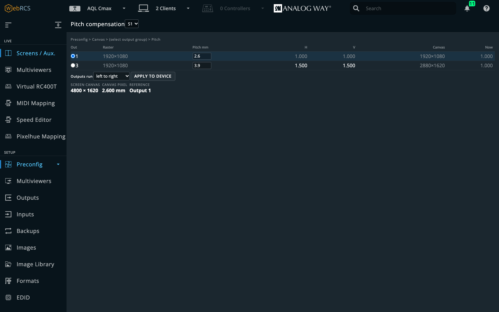

---

## OSC input

Off until you turn it on in **Preconfig ▸ LivePremier Plus → OSC input**. Then this app listens on
a UDP port, and QLab, TouchOSC, a lighting desk or Companion can drive the switcher — **with no
browser open**.

```
/lp/screen/1/take
/lp/screen/1/memory/5/recall/preview
/lp/master/memory/12/store
/lp/screen/1/preset/a/layer/2/opacity/opacity/norm 0.5
```

Every address, its argument and its range is in
[docs/OSC.md](https://github.com/stoatworks-labs/livepremier-plus/blob/main/docs/OSC.md) — generated
from the same tables that resolve the messages, so it cannot list an address that does not work.

- **The address is the target; the argument is only the value.** A button with a fixed address and
  no argument still means something specific.
- **A trigger fires on a non-zero argument and on none at all** — surfaces send 1 on press and 0 on
  release, and firing on both would take the screen twice.
- **A recall never defaults to program.** `…/recall` goes to preview.
- **`/norm` takes 0–1 and scales**; without it the value is in the switcher's own units — opacity is
  0–256, not 0–100.
- **Live layer parameters must name a buffer** — `/a`, `/b` or `/c`. Over UDP there is no way to
  know which letter is preview at this instant, so `preview` and `program` are refused with that
  reason rather than guessed. The Console can resolve them.

It binds to this machine only unless you choose otherwise, and the other option says in as many
words that the network will be able to fire takes.

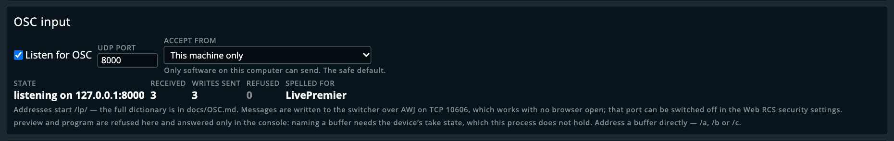

---

## MIDI Mapping

Under **Virtual RC400T**. Pick an input, an output for feedback, and a controller profile; press
Start. Faders, encoders and buttons then drive the selected layer.

The engine is [awj-surface](https://github.com/stoatworks-labs/awj-surface)'s, vendored whole along
with its stock profiles — X-Touch/Mackie, APC40, MIDIcon 2 and Pro, plus a generic learn profile.

**Soft pickup is the behaviour worth knowing.** A non-motorised fader will not move a live value
until it has swept *through* that value, so picking up a fader mid-show cannot jump a layer's
opacity. **The panel shows the hold-off rather than looking broken** — if a fader appears dead,
that is what you are seeing.

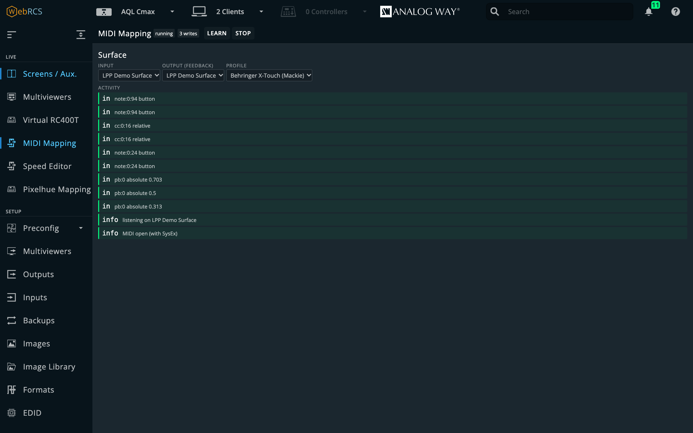

---

## Speed Editor (preview)

Under **Virtual RC400T**, beside MIDI Mapping. A DaVinci Resolve Speed Editor as a switcher panel.

1. **Plug the panel into the machine LivePremier Plus runs on** — by USB, or pair it over
   Bluetooth. Not the machine your browser is on, if those differ: the app holds the panel, not
   the page.
2. **Quit DaVinci Resolve.** Both would hear every key and fight over the lamps.
3. Open **Speed Editor**. It says *found* once it sees the panel.
4. Press **Start**. The app opens the panel, answers its handshake, and the JOG lamp lights.

Only one page drives the panel at a time. Another page with it started says *Another page is
driving it*, with **Take over** to move it there. Press **Stop**, or close the page, and the app lets
the panel go within a few seconds.

The panel is held by the app's **device host**, a helper program that the app starts and restarts if
it ever stops. Its state, and whether it has found the panel, is on **Preconfig ▸ LivePremier Plus**,
in the **Device host** card, with a **Restart** button. The desktop app carries it. Run from a
checkout, install it once with `npm run setup:devices`. The Docker image has no USB and no device
host, and the Speed Editor page says so.

The keys act on the selected screen, preset and layer:

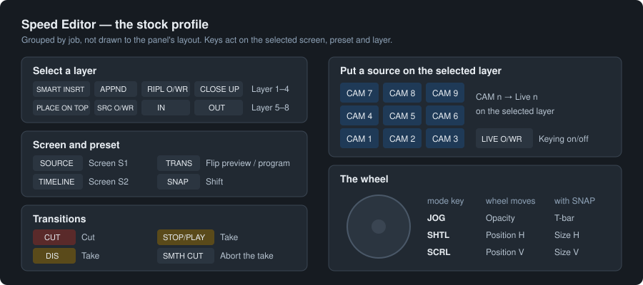

The wheel has the same **soft pickup** as a MIDI fader, and the panel's activity list shows each
write it made. The panel only talks after a handshake with the app, which is renewed before it
lapses; if a renewal fails the panel goes quiet and the page says so, then tries again. Unplug it
and plug it back in and it is found and answered again by itself.

> ⚠️ **Preview.** Proven on a real panel over USB on macOS against the simulator: CUT, the CAM keys,
> the wheel, the battery level and unplugging it and back. The key lamps, Bluetooth and Windows or
> Linux have not been tried yet. Treat the first show with one as a rehearsal.

---

## Pixelhue panel (preview)

A Pixelhue **U5**, **U5 Pro** or **U5 mini** event controller, driving the switcher. Off until you
turn it on in **Preconfig ▸ LivePremier Plus → Pixelhue panel**.

The buses are not mapped. The console is handed a model of this switcher — its screens, inputs and
memories — and labels, lights and pages its own keys from it; what comes back is what the operator
meant: *select screen S2*, *put input 2 on the selected layer*, *take*. So there is nothing to remap
when a firmware moves a key.

Everything else is, on **Pixelhue Mapping** — in the sidebar under Virtual RC400T, beside MIDI
Mapping. It draws the console in the Virtual RC400T's look, the buses showing what the console
shows, and every function key, fader and encoder carrying what it does. Click one to change it:
any key can take, cut, fade to black, step the layer, run the cue stack, **recall a memory to
preview** or **press a Companion button**, among others; a fader can follow its own layer or the
selected one; an encoder can move, size or fade the selected layer. Press a key on the console and
it lights up on the page and opens, so you can find it. A changed control has a blue dot, and
**Reset** puts everything back.

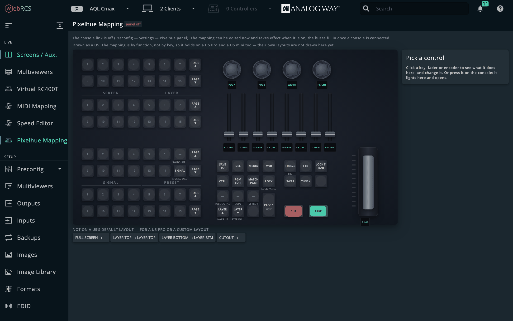

- A **U5 mini** answers on the network, so it is driven from wherever this app already runs.
- A **U5** or **U5 Pro** serves its control port to itself only, so this app has to run on the
  console — a Windows mini-PC with a touch screen, which runs the proxied Web RCS perfectly well.

> ⚠️ **This has never been run against a real console.** It was built from the consoles' firmware
> and proved against the vendor's own control service running with no panel attached. Treat the
> first show with one as a rehearsal. Fade-to-black and freeze are sent on LivePremier, not yet
> on a Midra 4K. docs/PIXELHUE.md lists what each key does.

---

## Thumbnail relay (preview)

Off until you switch it on in **Preconfig ▸ LivePremier Plus → Plugins**.

The switcher's source thumbnails are PNGs with next to no compression — about 150 KB each on an
Aquilon C, 590 KB on a Pulse 4K — and the Web RCS asks for every input's once a second or so,
whether anybody is looking at it or not. With the relay on, this app answers those requests
itself: one fetch from the switcher, re-encoded as a JPEG of 10–40 KB, handed to every page that
asks. The vendor's own source cards show it unchanged.

**The sources you are editing are refreshed faster; the rest are held.** A thumbnail drawn in a
screen or aux card on Screens / Aux. — or on the Edit page — and on screen is *hot*: the page
refreshes it itself, twice a second by default. While any are hot, every other source is answered
from the frame the relay already has until it is four seconds old. With nothing being edited,
every source is treated alike.

Its card on this settings page has the five settings and what the relay is doing:

| Setting | |
|---|---|
| **JPEG quality** | 30–95; 70 is hard to tell from the original on a card |
| **Max width** | 0 keeps the switcher's size |
| **Share for** | how old a frame may be and still go to a second page |
| **Hot refresh** | how often the edited sources refresh, 0.5–10 a second; 0 leaves them to the vendor |
| **Idle hold** | how old any other source may get while somebody edits; 0 turns holding off |

> ⚠️ **Proven on the simulator only.** A hot refresh faster than the switcher redraws its thumbnails
> fetches the same picture again. `node tools/snapshot-probe.mjs --device <address>` measures how
> fast that is — run it against a moving source before raising **Hot refresh**. The switcher still
> sends each thumbnail it is asked for in full; the saving is largest for a page on another machine.

## Multiviewer thumbnails (preview)

Off until you switch it on in **Preconfig ▸ LivePremier Plus → Plugins**.

The switcher already shows every source live on its multiviewer. Bring that multiviewer into the
browser and this plugin cuts each source out of it and puts it into the thumbnails — the Sources
panel, the screen and aux cards, this app's own pages — many times a second, instead of the
once-a-second pictures the switcher sends. It knows where each source sits from the switcher itself,
so there is nothing to line up.

**Choose the picture on each browser**, on the plugin's card on this settings page:

| This browser's picture | |
|---|---|
| **Off** | the switcher's own thumbnails, as always |
| **Capture device** | a capture card on this computer, plugged into the multiviewer output. Open the app at `localhost` on that computer. |
| **Stream (WHEP)** | the multiviewer as a stream from MediaMTX — from an encoder, or from a Midra 4K / Alta 4K's own streamer. Works on any computer or tablet. |
| **Test pattern** | a made-up multiviewer, for trying it on a simulator |

Then check the picture on the card: every green box should sit exactly on a source's picture, clear of
its label. If they do not, change **Picture in a widget**, **Sits** or **Trim** until they do.

| Setting | |
|---|---|
| **Multiviewer** | which of a LivePremier's multiviewers is on the capture |
| **Picture in a widget** | 16:9 or 4:3 fitted inside each widget, or the whole widget |
| **Sits** | where a fitted picture is — centre, top or bottom |
| **Trim** | taken off every edge, for a tally border drawn over the picture |
| **Frames a second** | how often the thumbnails are redrawn, 1–25 |
| **Max width** | how large a thumbnail is drawn |

**Midra 4K and Alta 4K: using the switcher's streamer.** Run MediaMTX on a computer on the show
network, put its address in **RTMP address** (`rtmp://<computer>:1935/lpp-mv`), and press **Stream
the multiviewer here**. It asks first, writes one of the streamer's ten destinations (10 unless you
change it), sets the multiviewer as the picture and starts it. It will not touch a streamer that is
already streaming something else — it is the unit's only one. Set the browsers to **Stream (WHEP)**.
The pictures run about a second behind the switcher.

If the capture stops, or a source leaves the multiviewer, its thumbnails go back to the switcher's own
within three seconds. Set a browser to **Off** at any time to have them all back.

> ⚠️ **Proven on the simulator only**, with the test pattern. It has never seen a real multiviewer
> output, and the simulators never start a stream, so starting the streamer is untested.

---

## Background Slicer (preview)

Off until you switch it on in **Preconfig ▸ LivePremier Plus → Plugins**. Then **PLUS ▸ Background
Slicer** — **Pop out** gives it a window of its own.

A background set gives each output of a screen its own still or input, and shows it **1:1 in the
output** — no scaling. So a picture that spans a wall must be cut into exactly the piece each output
shows, at exactly that output's resolution. This does the cutting, and fills the set.

**Stills — a picture as the background**

1. **Picture** — choose a file, or drop one on the box. Its size is shown.
2. **Screens** — click the screens it goes on. With two or more, choose **On each screen** (the
   picture placed on each separately) or **Span selected screens** (the screens side by side, in
   order, under one picture; type where each sits in the strip if they are not edge to edge).
3. **Placement** — the screen's canvas with its outputs drawn on it, and the picture over them. Drag
   the picture, or type **X / Y / W / H** in canvas pixels — sums work, and so do variables such as
   `$S1.width/2` or `@gap` — or press **Fit**, **Fill**, **Stretch**, **1:1** or **Centre**. An output outlined in orange dashes is one whose cut rests on something not
   yet seen on a real frame — rotated, grouped, sliced or pitched; hover it to see which.
4. **Plan** — nothing has been written yet. For each screen, the **background set** it goes into
   (the first empty one; pick another if you like — one with content says so). For each output: its
   resolution, the **library slot** and **still** it will use (free ones only — nothing is ever
   overwritten unless you pick a set that has content), the still's **capacity** and whether it must
   change, the **content**, what it **replaces**, and whether the cut is a **pixel copy** or
   **resampled** (anything scaled: Fit, Stretch, an LED pitch ratio). A red line is something that
   stops it; fix it first.
5. **Generate** — cuts one PNG per output. The thumbnails show them; **Download images** saves them
   as a zip. **Background** is the colour where the picture does not reach.
6. **Write** — give the sets and stills a **name** (16 characters). **Put them into a background
   set** is on; switch it off to leave the images in the library and the stills and touch no set.
   Tick **Load each set into its screen's preview** if you want it ready to take. **Write to the switcher…** says what it will
   do and asks. Each step then shows as it lands. If one fails it stops there; **Undo what was
   written** takes everything it wrote back off.

Good to know:

- A set that is **on program** is refused unless you tick that it may be written live — a set's
  content changes on air the moment it is written.
- Raising a still's **capacity** (for a 4K output, say) is a preconfig change. It is only applied
  when the switcher's own check says no still in use would be lost; and not at all while someone has
  other changes waiting in Preconfig ▸ Images.
- A screen shows a background set through its **NATIVE layer**. If the screen has none allocated
  (Preconfig ▸ Resources), the set is built but cannot be loaded, and the panel says so.

**Live inputs — a media server as the background**

Switch to **Live inputs**. The steps are the same, without Generate: each output gets an **input**
instead of a still (free ones are suggested, an input already receiving the output's format first,
marked ✓; one input per output), and the set takes that input.
**Load each input plug with the switcher's EDID** (on by default) makes each input ask its source for
exactly the output's resolution and rate — a live background must match its output's format. No
picture is needed: type the **content** size your media server works in.

Then the media server has to play, into each input, exactly the piece of its content that the
output shows. **Media server** downloads that map:

| | |
|---|---|
| **Resolume Arena** | an Advanced Output preset. Copy it into `Documents/Resolume Arena/Presets/Advanced Output/`, choose it in Output ▸ Advanced Output, then bind each screen to its real output. |
| **disguise** | a Feed Mapping table: put it in `<project>/objects/Table/`, then Feed Mapping ▸ Import from table. |
| **Pixera**, **Hippotizer**, **Millumin**, **TouchDesigner** | files they load, with the step each leaves by hand — the list under *What each media server can import* says which. |
| **QLab**, **Mitti**, **MadMapper**, **Watchout** | no file they can import; the pack's templates and the recipe beside each. |

**Everything (.zip)** has all of it, plus `pixel-map.csv` / `.json` (every region, in pixels) and
templates — the whole content and each output, every region outlined and labelled with its size —
to load into any server as a guide.

> ⚠️ **Proven on the simulator only.** A simulator's outputs are a still picture, so a background
> written there cannot be seen. Check the first one on a real output — especially a rotated one: if
> the picture comes out turned twice, say so.

---

## Arithmetic in numeric fields

Type an expression into one of Web RCS's own numeric fields and it is evaluated when you commit —
on Enter, or on leaving the field:

| typed | becomes |
| --- | --- |
| `1080-80` | `1000` |
| `(1920-40)/2` | `940` |
| `1920*2` | `3840` |

`+ - * / ( )` and decimals, with the usual precedence. **The result is clamped to the field's own
declared range and rounded to its step**, so a width of `9000+1000` lands on 8192 rather than being
refused.

Nothing else about the field changes: the vendor still validates it, still decides what to send,
and still drags the other axis along if the aspect lock is on.

**Where it applies is narrow on purpose.** Only fields the vendor itself marks as numeric by
putting `min`, `max` and `step` on them. That excludes everything that must not be touched — labels
have no `step`, and neither does the transition-time field, whose `00:01.000` would be mangled by
anything treating `:` as arithmetic.

**Opacity and zoom are deliberately excluded.** They are real number inputs, and a number input
*discards* anything it cannot parse — after typing `1080-80` the browser reports an empty value, and
the expression is visible on screen but unreadable from script. Winning arithmetic there would mean
mutating a vendor element's type on every focus, in a UI driving a live show. Not a good trade.

There is **no `eval`** anywhere in this path; anything the parser does not fully understand is
refused rather than guessed at.

With **Variables** on (next section), a field takes them too: `$S1.width/2`, `@gap*3`. One that
cannot be read right now is not applied — the field flashes amber and its tooltip says why.

---

## Variables

**PLUS ▸ Variables.** Names for numbers, usable wherever a number goes: in the Console, in the
vendor's numeric fields, in an OSC argument. Two kinds:

- **`$` — the switcher's.** `$S1.width`, `$S1.PGM.L2.x`, `$IN3.rate`, `$OUT1.cw`, `$device.model`
  and a few hundred more, read live. They are generated from what the switcher has — the screens
  in service, each one's allocated layers, the fitted inputs and outputs — so a bigger rig lists
  more. Search the table; click a name to copy it.
- **`@` — yours.** Press **Add**, name it, give it a definition: `@gap` = `40`,
  `@half` = `$S1.width / 2`. The Value column shows what it comes to now, and says why when it
  comes to nothing. Kept for this switcher, and in the setup file.

```
Set Screen 1 Layer 2 Size ($S1.width / 2) $S1.height       at the Console
Set Screen 1 Layer 2 Position (@gap * 3) 540
$S1.width/2                                                 in a width field
```

**Arithmetic goes in brackets at the Console.** `Take Screen 4 - 1` is still screens 4 without 1;
`Take Screen (4 - 1)` is screen 3. In a field there is no list, so `$S1.width/2` needs none.

Four things it refuses rather than guesses, each with a sentence saying so:

- **a layer by role while its screen is mid-take** — `$S1.PGM.L2.x` names whichever buffer is
  program, and during a transition that is changing hands;
- **a layer that is not allocated** — the preset holds geometry for every slot, but only allocated
  layers are real;
- **anything the switcher has not reported** — a canvas, a memory — rather than a default;
- **a cycle** — `@a` naming `@b` naming `@a`, spelled out above your table.

**Over OSC, only `@` variables that do not depend on a `$` one** work, because the OSC listener
holds no copy of the switcher's state — the same reason it refuses `preview` and `program`.

The plugin **only reads**; it never writes to the switcher, and a field or a Console line still
goes out when you commit it. The full namespace is in [VARIABLES.md](VARIABLES.md).

---

## The demo environment

```bash
npm run demo
```

brings the whole thing up against a **LivePremier Simulator**, with a real Aquilon C's resource map
folded in and an example cue stack loaded, so every panel has something real to show without a
switcher in the room.

The simulator has **no VPU at all**, so the panel against a bare one correctly reports there is
nothing to draw; the demo supplies that from the recorded capture — 32 of 64 mixers fitted, 26
allocated, one screen in Optimized mode, and a staged preconfig differing in 26 mixers. Everything
outside that stays the simulator's own live state, **so cues fired from the timeline really do go
on the wire.**

> **It refuses to run against anything that is not loopback.** The demo splices a store subtree and
> seeds a cue stack, and "I thought it was the simulator" is exactly the mistake worth making
> impossible.

The demo's cue stack lives in a temporary directory and is deleted on exit; your own is never
touched.

---

## Switching features off

**Preconfig ▸ LivePremier Plus → Plugins** lists every feature this app adds, each with a switch.
Everything is on until you switch it off, except the previews that say otherwise.

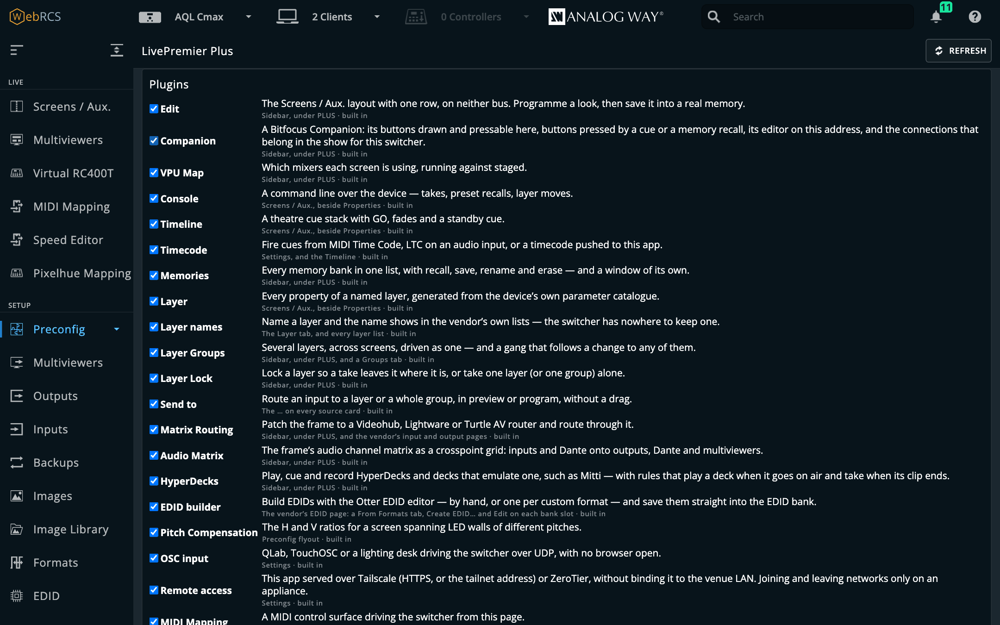

- A switched-off feature is **gone, not hidden**: no sidebar entry or tab, nothing added to the
  vendor's page, and no background service — an OSC listener closes, router and Companion
  connections hang up.
- **Reload the page** after a change. The server side applies straight away; the page picks it up
  on the next load, and the card reminds you.
- Some features need others. **Send to** needs **Layer Groups**, and **Timecode** needs the
  **Timeline**: switch Groups off and Send to goes with it, marked *needs Layer Groups*, and comes
  back when Groups does.
- A feature's own switch is separate. Switching **OSC input** on as a plugin brings its settings
  back; the listener itself still starts off until you tick *Listen for OSC*.

### Adding a plugin of your own

A plugin somebody wrote — or you did — is a folder you put in the **`plugins` folder of the app's
data directory**: `~/.livepremier-plus/plugins/` for the desktop app, `/config/plugins/` in Docker.

1. Copy the plugin's folder in, and **restart the app**.
2. In **Preconfig ▸ LivePremier Plus → Plugins** it is listed under **Added by you**, switched off.
3. Tick it. You are asked to confirm, because a plugin runs inside this app with full control of it
   and of the switcher. **Only switch on plugins you trust.** Then reload the page.

Nothing in a plugin's folder runs until you switch it on. A folder that is not a working plugin is
listed with the reason instead. The app's source has an example to start from in
`examples/plugins/hello-switcher`, and `docs/PLUGINS.md` is the guide to writing one.

---

## Saving and restoring your setup

A `.awc` from the switcher restores the *processor* — inputs, outputs, screens, memories.
It holds nothing about this app: your cue stack, your layer groups, the names you gave
layers, the patch to the external routers. Restore a `.awc` on its own onto a fresh frame
and the show comes back with no cue list.

So this app can write all of that into one file:

```
curl -o livepremier-plus.json 'http://127.0.0.1:8535/__lpp/config?download=1'
```

It is plain JSON — readable, diffable, fine in a git repo. It carries which switcher it
was written against, and three separate groups:

- **installation** — app settings (console language, OSC port and bind) and your external
  routers. Not tied to a switcher.
- **show** — the cue stack, layer groups, layer names, layer locks, your variables and Companion memory triggers. Tied to the switcher they were
  built on, because they name screens and layer slots like `S1/2`.
- **rig** — the patch between the frame and the routers.

To restore, POST it back:

```
curl -X POST -H 'content-type: application/json' \
     --data-binary @livepremier-plus.json \
     http://127.0.0.1:8535/__lpp/config
```

By default that restores the show and the rig and your routers, and **leaves the app
settings alone** — a restore should not quietly change the OSC port a lighting desk is
sending to. Ask for them explicitly if you want them:

```
{ "doc": { … }, "sections": ["stack", "groups", "names", "patch", "settings"] }
```

**Reload any open page afterwards.** The restore reaches the running app at once — the routers
are dialled, the patch and any settings you asked for are the ones in force — but a Web RCS page
that was already open still holds the cue stack, groups and names it loaded, and its next save would
put those back. The answer to the restore says `"reloadPages": true` when that applies.

**A feature that is switched off is left out** of both: its section is not written, and a file that
has one reports it as skipped rather than restoring it. A plugin of your own can add a section of
its own — see [PLUGINS.md](PLUGINS.md#contribution-points).

**Onto a different frame.** The device-keyed parts land under whichever switcher this app
is currently pointed at, so failing over to a backup frame at another address is just:
point the app at the backup, then POST the file. Add `"device": "192.168.2.141"` to send it
somewhere else again. To see what a file would do before doing it, POST it to
`/__lpp/config/inspect`.

**Both halves in one file.** [Showbook](https://stoatworks-labs.com/software/showbook/)
keeps this file beside the `.awc` for the same show and exports the pair as one
`.showbook` bundle — or, if you want a single file you can restore straight from the
switcher's own Web RCS, it can put this configuration *inside* the `.awc`. The switcher
accepts it and ignores it; this app reads it back out. Note the switcher does not keep it:
a `.awc` you export from Web RCS afterwards will not contain it.

## If something is wrong

| Symptom | Cause |
| --- | --- |
| **No panels in Web RCS** | You opened the switcher's address directly. Go through the proxy. |
| **MIDI does nothing** | Same cause — Web MIDI needs a secure context, which loopback is and a LAN address is not. |
| **A fader does not move anything** | Soft pickup. Sweep it through the current value. |
| **The Speed Editor does nothing** | DaVinci Resolve is still running, or the panel is plugged into a different machine from the one the app runs on, or another page is driving it (**Take over**), or the device host is not running (see the **Device host** card in Preconfig ▸ LivePremier Plus), or this is the Docker image, which has no USB. |
| **A console command means the wrong thing** | The grammar is mynah's; the fix is there. |
| **Arithmetic does not work in a field** | It is not one the vendor marks numeric — opacity and zoom are deliberately excluded. |
| **The VPU panel says there is nothing to draw** | A simulator has no VPU. That is correct, not a failure. |
| **The demo refuses to start** | It only runs against loopback, on purpose. |
